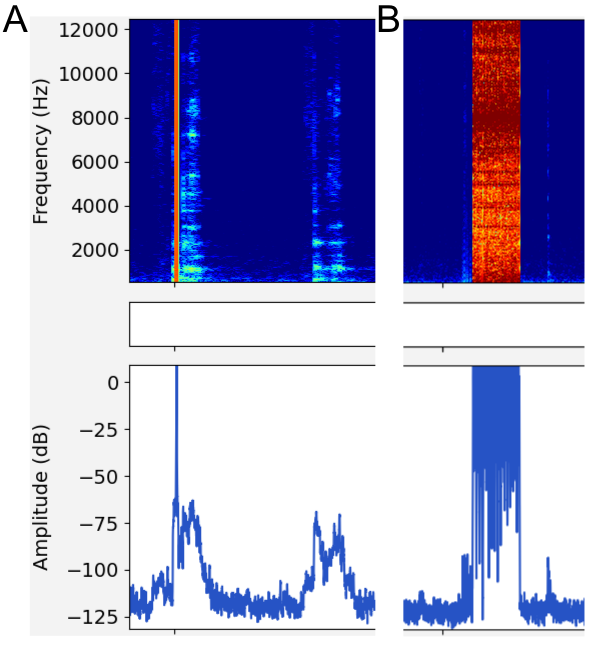
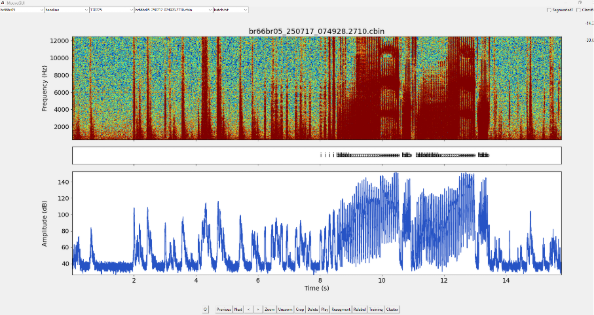
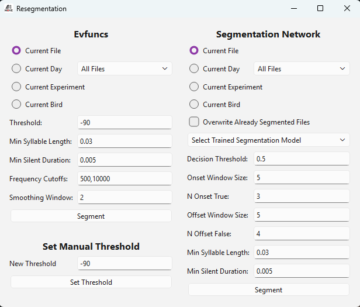
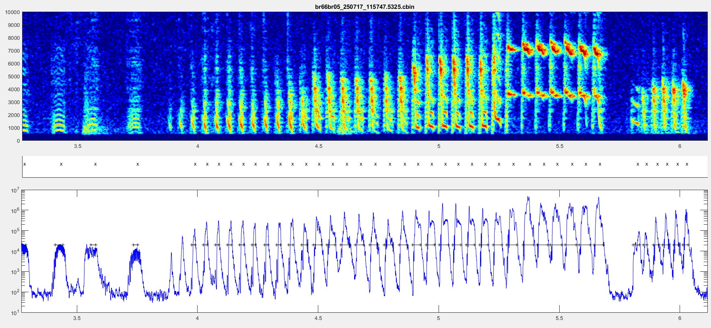

.. _faq:

FAQ
===

Installation & setup
--------------------

Which Python version should I use?
~~~~~~~~~~~~~~~~~~~~~~~~~~~~~~~~~~~

Moove supports Python 3.10 through 3.12.  We recommend **Python 3.11**
as it has been tested most extensively.

Do I still need Tkinter?
~~~~~~~~~~~~~~~~~~~~~~~~

No.  Moove now uses **PyQt6** for its GUI.  The previous dependency on
Tkinter (and the related packages ``ttkbootstrap`` / ``ttkwidgets``) has
been removed.  If you see old instructions mentioning ``python3-tk`` or
``import tkinter``, you can safely ignore them.

I get "No module named sounddevice" or a PortAudio error
~~~~~~~~~~~~~~~~~~~~~~~~~~~~~~~~~~~~~~~~~~~~~~~~~~~~~~~~~

``sounddevice`` requires the **PortAudio** C library at runtime.

- **Windows**: PortAudio is bundled with the pip package -- a simple
  ``pip install sounddevice`` should be enough.
- **macOS**: Install PortAudio via Homebrew first:
  ``brew install portaudio``
- **Linux**: Install the development package:
  ``sudo apt install portaudio19-dev``

After installing the system library, reinstall sounddevice:
``pip install --force-reinstall sounddevice``.

How do I enable ASIO on Windows?
~~~~~~~~~~~~~~~~~~~~~~~~~~~~~~~~

Set the environment variable ``SD_ENABLE_ASIO=1`` before starting Moove.
In PowerShell:

.. code-block:: powershell

   $env:SD_ENABLE_ASIO = "1"
   moovegui

See :ref:`asio-setup` in the Installation chapter for more details,
including the legacy manual DLL-replacement method.

PyTorch fails with WinError 1114 / WinError 126 on Windows
~~~~~~~~~~~~~~~~~~~~~~~~~~~~~~~~~~~~~~~~~~~~~~~~~~~~~~~~~~~

If you see ``OSError: [WinError 1114] A dynamic link library (DLL)
initialization routine failed`` (referencing ``c10.dll`` or
``fbgemm.dll``), you are likely missing the Intel OpenMP runtime.

**Quickest fix** -- install the CPU-only PyTorch wheel (sufficient for
most Moove use cases):

.. code-block:: powershell

   pip install torch --index-url https://download.pytorch.org/whl/cpu

**If you need CUDA support**, install the missing runtime and reboot:

.. code-block:: powershell

   pip install intel-openmp

A system reboot after installing is sometimes required.  For more
details, see `pytorch/pytorch#131662
<https://github.com/pytorch/pytorch/issues/131662>`_.

NumPy 2.x -- is it supported?
~~~~~~~~~~~~~~~~~~~~~~~~~~~~~~

Moove no longer pins an upper bound on NumPy.  In most cases NumPy 2.x
works fine, but some edge cases (especially around integer-type
behaviour changes in NumPy 2.0) may surface.  If you encounter
unexpected errors, try pinning NumPy < 2:

.. code-block:: bash

   pip install "numpy<2"

Poetry errors during installation
~~~~~~~~~~~~~~~~~~~~~~~~~~~~~~~~~~~~~

Moove has migrated from Poetry to **uv** / **hatchling**.  If you cloned
an older version of the repository that still uses ``poetry.lock``, pull
the latest changes and use ``uv sync`` instead.  For pip installations,
nothing changes -- ``pip install moove`` continues to work as before.

Using MooveTaf
--------------

My recording starts but the threshold for recording is never triggered
~~~~~~~~~~~~~~~~~~~~~~~~~~~~~~~~~~~~~~~~~~~~~~~~~~~~~~~~~~~~~~~~~~~~~~~~~~~

If your MooveTaf starts normally after selecting an input and output device, 
you should see the line "Threshold triggered" in the terminal once you make a sound. 
If this line never appears, your threshold is probably not adjusted well to your setup. 
You can change the threshold for recording in the ``config.ini`` file in your ``.moove`` folder. 
Per default, the threshold is set pretty low as it was optimized for the setups in our lab. 
If your threshold is never triggered, play around with it by setting it even lower to perfectly adjust it to your setup. 
You know it's perfectly set when your sound source triggers it and a file is saved only after the sound has ended, 
but it does not get triggered from minimal noise sources. 

In case you are never able to record a sound, make sure that your setup, and especially your microphone connection, 
works properly or try using a different input device.

.. note::

   Remember that dB is a logarithmic and relative scale, so changing the threshold does not work as linear as one might think. 

My recording starts but my bouts are not saved
~~~~~~~~~~~~~~~~~~~~~~~~~~~~~~~~~~~~~~~~~~~~~~~~~~~~~~~~~~~~~~~~~~~~~~~~~~~

If your MooveTaf starts normally and you see the line "Threshold triggered", 
once your sound ends the line "Saving Bout" should appear in the terminal. 
In case the line "Threshold triggered" never disappears, it is very likely 
that your threshold is too sensitive (too low for your setup). 
You can adjust the value in the ``config.ini`` file in your ``.moove`` folder. 
Per default, the threshold is set pretty low as it was optimized for the setups in our lab. 
If your recording never ends (threshold is triggered constantly) you need to set the value higher (closer to 0 or above). 
You know it's perfectly set when your sound source triggers it and a file is saved only after the sound has ended, 
but it does not get triggered from minimal noise sources. When a bout is saved is also defined 
by the parameters ``t_before``, ``t_after`` and ``min_bout_duration`` set in the ``config`` file. 
These define the amount of silence in seconds, that has to be recorded before and after the bout, respectively, 
as well as the minimum duration the sound has to last in order to be saved. If these criteria are not met, the bout is not saved.

From our experience, when using pre-recorded songs to test the setup, noise can be part of the playback 
and therefore the saving criteria described about might not be met. In this case, make sure to have a few seconds 
of complete silence after the playback and see if your bout gets saved.

.. note::

   Remember that dB is a logarithmic and relative scale, so changing the threshold does not work as linear as one might think. 

Where are my recorded files?
~~~~~~~~~~~~~~~~~~~~~~~~~~~~~~~~~~~~

If your files have been recorded and saved according to your terminal output, you can find them in your ``.moove`` folder. 
The ``.moove`` folder is created in your home directory on first start.
Folders beginning with ``.`` are hidden by default on Linux and macOS:

- **macOS**: Press ``Cmd + Shift + .`` in Finder
- **Linux**: Press ``Ctrl + H`` in your file manager

The folder location can be changed -- see *MooveTAF* for details. If you do so, the files fill be saved in that directory 
instead of your home directory.

.. attention::
   Do not delete the ``.moove`` folder that was created in your home directory initially, as the new saving directory
   has to be set here in the initial ``config`` file. Any changes to the ``config`` have to be made within the original directory.

My recording seems to stop in the midde of a syllable/ bout
~~~~~~~~~~~~~~~~~~~~~~~~~~~~~~~~~~~~~~~

If you ever see a syllable or bout being cut off in the middle, 
it is very likely that your threshold is not set correctly.
Whether a file is terminated and saved depends on threshold crossing of the sound
source rather than a syllable still being detected (onsets can be detected even when the threshold is not triggered).

You can adjust the value in the ``config.ini`` file in your ``.moove`` folder.
We really recommend taking some time to adjust the threshold correctly to your setup, 
as it can strongly affect the quality of your recordings.

Why are there big red "stripes" in the middle of my recordings?
~~~~~~~~~~~~~~~~~~~~~~~~~~~~~~~~~~~~~~~~~~~~~~~~~~~~~~~~~~~~~~~~~~~~~~~~~~~~~~

Moove is a pretty computation-heavy program. While you record with MooveTaf, we strongly recommend not 
using the computer for anything else. If you want to do so, make sure that your computer meets
some requirements, i.e. having at least 32GB RAM and/or a decent CPU and/or a decent GPU. With this,
we were able to do for example electrophysiological recordings while recording song, just keep in 
mind that the performance strongly depends on your setup.

   Figure: Example of audio artifacts.

When doing things in parallel that are not as computation-heavy and don't require fast processing,
make sure that you set the processing priority for MooveTaf as high as possible (as described in *MooveTaf*).
We do recommend this setting for every recording, especially when using online classification and targeting 
as it can strongly improve the performance of the program.

.. note::
   
   Try to avoid opening the MooveGUI while recording, as it can affect the performance of MooveTaf. 
   If you want to check your recorded files while MooveTaf is running, make sure that your priority is set 
   correctly as described above. Also, opening MooveGUI while recording can cause writing mistakes in 
   your batch.txt file, as both programs are accessing it at the same time. These can be fixed as 
   described in *MooveGUI - Main Window*.

Using MooveGUI
--------------

Where is my .moove folder?
~~~~~~~~~~~~~~~~~~~~~~~~~~~~~

The ``.moove`` folder is created in your home directory on first start.
Folders beginning with ``.`` are hidden by default on Linux and macOS:

- **macOS**: Press ``Cmd + Shift + .`` in Finder
- **Linux**: Press ``Ctrl + H`` in your file manager

The folder location can be changed -- see *MooveTAF* for details.

Why does my GUI not open anymore?
~~~~~~~~~~~~~~~~~~~~~~~~~~~~~~~~~~~~~~~~~~~~~~~~~~~~~~~~~~~~~~~~~~~~

In case you encounter an error stating something like "file cannot be found" while trying to open the GUI, 
it is very likely that you changed something in your folder structure and/ or deleted a file/ folder that
you've been working on before. In this case, go to your ``.moove`` folder and delete the ``app_state.json``
file. This will reset your GUI to default values, meaning that your slider settings, as well as the index
of the file you've worked on last will be gone, so it should only be done if unavoidable. 

.. note::
   All changes to a file are saved immediately in the GUI, so you will **not** loose any progress in segmentation,
   labelling etc. when doing this!

Why are my trained models saved as .zip?
~~~~~~~~~~~~~~~~~~~~~~~~~~~~~~~~~~~~~~~~~~~~~~~~~~~~~~~~~~~~~

When copying model files from Windows to Linux they may appear as
``.zip`` archives.  Simply extract them; the resulting ``.pth`` files
can be used directly in the config.

My spectrogram looks wrong or is empty
~~~~~~~~~~~~~~~~~~~~~~~~~~~~~~~~~~~~~~~

If the spectrogram is not visible or the song is hard to recognise, the
dB slider range is likely incompatible with your data.  Adjust the vmin/vmax
sliders on the right side of the GUI, or set initial values in the
config file (see *Setting the config*).  For ``.cbin`` files, slider
values between +40 and +100 often work well.

If your GUI plots appear to be completely empty, it is very likely that your 
folder path is incorrect. Make sure that you can set the bird, experiment and 
day folder and batch file correctly in the upper task bar. If not, check if your 
folders are structured according to as it is described in *MooveTaf - Baseline recordings*.

What if my segmentation looks ugly?
~~~~~~~~~~~~~~~~~~~~~~~~~~~~~~~~~~~~

Case: Repeats
^^^^^^^^^^^^^

Offline segmentation
""""""""""""""""""""

.. figure:: _static/images/image37.png
   :alt: Training window
   :width: 3.64977in

   Figure: Training window settings.

For repeat segmentation, first hand-segment the repeats correctly, then
create a dataset and train a network using the *Training* window (see
*Train the segmentation network*) on **Segmented files only**.  Ensure
that downsampling is **not activated** to capture every single repeat
syllable.

Once the network is trained, adjust the onset/offset detection
parameters when resegmenting your files.  The *min syllable length* and
*min silent duration* parameters can improve accuracy.  Always make sure
to **not** tick "Overwrite already segmented files" to preserve your
hand-corrected data.

.. figure:: _static/images/image34.png
   :alt: Resegmentation window
   :width: 3.73128in

   Figure: Resegmentation window.

Example parameters for repeat segmentation:

   Figure: Correctly segmented repeats after parameter adjustment.

Online classification
"""""""""""""""""""""

Online classification of syllables is performed within 30 ms after
syllable onset by default.  You can reduce this window for very short
syllables by changing the audio chunk size and number of input chunks in
the Training window.  With default parameters (chunk size 64 at
44.1 kHz, 21 input chunks) the classification latency is
1.45 ms × 21 ≈ 30 ms.  Adjusting these parameters can decrease
latency but may reduce accuracy.