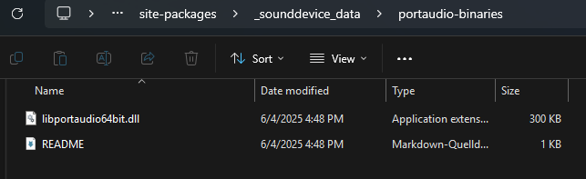
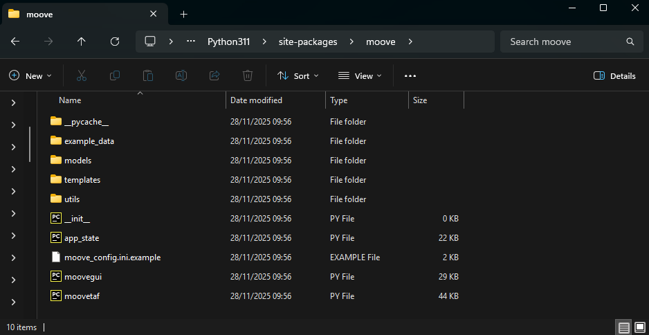
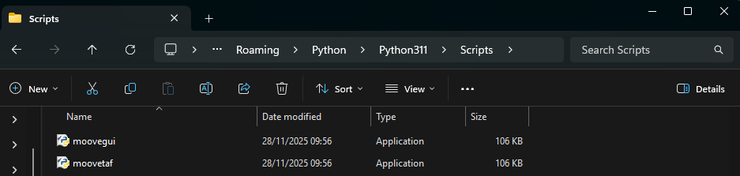
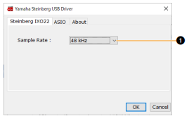
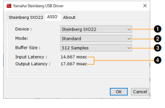
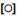
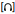

.. _installation:

Installation
============

Quick start
-----------

The fastest way to get Moove running (requires Python 3.10 -- 3.12 and
`uv <https://docs.astral.sh/uv/>`_):

.. code-block:: bash

   git clone https://github.com/veitlab/moove.git
   cd moove
   uv sync
   uv run moovegui        # GUI for datasets & training
   uv run moovetaf        # real-time recording & targeting

If you do not have ``uv`` yet:

.. code-block:: bash

   # macOS / Linux
   curl -LsSf https://astral.sh/uv/install.sh | sh

   # Windows (PowerShell)
   powershell -ExecutionPolicy ByPass -c "irm https://astral.sh/uv/install.ps1 | iex"

Requirements
------------

- **Python 3.10 -- 3.12** (3.11 recommended)
- **PortAudio** -- required by ``sounddevice`` for audio I/O (see
  :ref:`platform-notes` below)
- A working audio input/output device for real-time experiments

.. _install-pip:

Installing with pip
-------------------

Moove can also be installed from PyPI:

.. code-block:: bash

   pip install moove

or for a specific version:

.. code-block:: bash

   pip install moove==1.1.0

After installation the entry points ``moovegui`` and ``moovetaf`` are
available on your ``PATH``.  A default configuration file
(``moove_config.ini``) will be created at ``~/.moove/`` on first start.

Installing from source with uv (recommended for development)
------------------------------------------------------------

.. code-block:: bash

   git clone https://github.com/veitlab/moove.git
   cd moove
   uv sync          # creates .venv and installs all deps
   uv run moovegui  # run the GUI

``uv sync`` resolves all dependencies (including PyQt6, PyTorch, etc.)
into an isolated virtual environment.  This is the recommended method for
development because it is fully reproducible via the checked-in
``uv.lock`` file.

.. _platform-notes:

Platform-specific notes
-----------------------

Windows
~~~~~~~

PortAudio is bundled with the ``sounddevice`` pip package on Windows, so
no extra system-level installation is needed.

.. code-block:: powershell

   pip install moove
   moovegui

.. note::

   **Anaconda/conda users:** When installing via ``uv``, use Python from
   `python.org <https://www.python.org/downloads/>`_ (3.10 -- 3.12), not
   the Anaconda interpreter.  Anaconda's DLL search path can conflict with
   PyQt6 and cause ``ImportError: DLL load failed``.  If you use Anaconda,
   install Moove via conda instead (see :ref:`conda installation
   <conda-install>` — coming soon).

**PyTorch DLL errors on Windows:**  Some Windows systems are missing the
Intel OpenMP runtime (``libomp140.x86_64.dll``) that PyTorch's CUDA
wheels depend on.  This causes ``WinError 1114`` or ``WinError 126``
when importing ``torch``.  Two workarounds:

- **If you do not need GPU acceleration** (works for most Moove use
  cases), install the CPU-only PyTorch wheel:

  .. code-block:: powershell

     pip install torch --index-url https://download.pytorch.org/whl/cpu
     pip install moove

- **If you need CUDA**, install the missing OpenMP library and reboot:

  .. code-block:: powershell

     pip install intel-openmp

  If that does not help, manually place ``libomp140.x86_64.dll`` into
  ``C:\Windows\System32`` (see `pytorch/pytorch#131662
  <https://github.com/pytorch/pytorch/issues/131662>`_).

If you need **low-latency ASIO support**, see :ref:`asio-setup` below.

macOS
~~~~~

PortAudio must be installed via Homebrew **before** installing Moove:

.. code-block:: bash

   brew install portaudio
   pip install moove
   moovegui

If you use ``uv`` you only need PortAudio on the system; ``uv sync``
handles everything else.

Linux (Debian / Ubuntu)
~~~~~~~~~~~~~~~~~~~~~~~

Install the PortAudio development library and system dependencies:

.. code-block:: bash

   sudo apt update
   sudo apt install python3-dev gcc portaudio19-dev

Then install Moove in a virtual environment:

.. code-block:: bash

   python3 -m venv .venv
   source .venv/bin/activate
   pip install moove
   moovegui

Or with ``uv``:

.. code-block:: bash

   uv sync
   uv run moovegui

.. note::

   Previous versions of Moove required ``python3-tk`` (Tkinter).  Since
   Moove now uses PyQt6 for its GUI this dependency is no longer needed.

.. _asio-setup:

Enabling ASIO support (Windows)
-------------------------------

Moove's real-time targeting depends on low audio latency.  On Windows
the **ASIO** audio driver provides the lowest latency and is strongly
recommended for real-time experiments.

Modern method (sounddevice ≥ 0.5)
~~~~~~~~~~~~~~~~~~~~~~~~~~~~~~~~~

Recent versions of ``sounddevice`` ship **two** PortAudio DLLs -- one
with and one without ASIO support.  You can activate ASIO by setting an
environment variable **before** starting Moove:

.. code-block:: powershell

   # PowerShell -- temporary (current session only)
   $env:SD_ENABLE_ASIO = "1"
   moovegui

   # or permanently via System Environment Variables

This is the easiest method and does not require manual file replacement.

Legacy method (manual DLL replacement)
~~~~~~~~~~~~~~~~~~~~~~~~~~~~~~~~~~~~~~~

If your ``sounddevice`` version does not include the ASIO DLL, you can
replace the PortAudio binary manually:

1. Locate the PortAudio DLL in your ``sounddevice`` installation.
   Common paths:

   .. code-block:: text

      C:\Users\<User>\AppData\Roaming\Python\<Version>\site-packages\_sounddevice_data\portaudio-binaries\
      C:\Users\<User>\AppData\Local\Programs\Python\<Version>\Lib\site-packages\_sounddevice_data\portaudio-binaries\

2. You should see ``libportaudio64bit.dll`` and possibly
   ``libportaudio64bit-ASIO.dll``.

3. If both files exist: delete ``libportaudio64bit.dll`` and rename
   ``libportaudio64bit-ASIO.dll`` to ``libportaudio64bit.dll``.

4. If only the non-ASIO DLL exists: download the ASIO-enabled binary
   from https://github.com/spatialaudio/portaudio-binaries and replace
   the existing file.

5. **Install the Steinberg ASIO driver** for your audio interface,
   restart your PC, and verify that ASIO devices appear when starting
   MooveTaf.

   The portaudio-binaries folder with both DLL variants.

Custom PortAudio path
~~~~~~~~~~~~~~~~~~~~~

You can also point ``sounddevice`` to a custom PortAudio build via the
``SD_PORTAUDIO`` environment variable:

.. code-block:: powershell

   $env:SD_PORTAUDIO = "C:\path\to\my\libportaudio64bit.dll"
   moovegui

This is useful if you compile PortAudio with ASIO support yourself.

Installing with conda
---------------------

.. note::

   The conda-forge package is prepared but **not yet uploaded**.
   The instructions below will work once the feedstock has been accepted.

Moove can be installed from conda-forge:

.. code-block:: bash

   conda install -c conda-forge moove

or, if you use `mamba <https://mamba.readthedocs.io/>`_ (recommended for
faster dependency resolution):

.. code-block:: bash

   mamba install -c conda-forge moove

This will automatically pull in all required dependencies including
PortAudio, PyTorch, matplotlib, and the helper packages (evfuncs,
rangeslider, etc.).

After installation the entry points ``moovegui`` and ``moovetaf`` are
available on your ``PATH``:

.. code-block:: bash

   moovegui        # GUI for datasets & training
   moovetaf        # real-time recording & targeting

.. note::

   The conda-forge PortAudio package does **not** include ASIO support
   due to the proprietary Steinberg ASIO SDK license.  For Windows
   real-time experiments that require ASIO, use the pip installation
   instead (``pip install sounddevice`` bundles ASIO-enabled binaries).

Where is Moove installed?
-------------------------

After ``pip install moove``, the package lives in your Python
``site-packages`` directory.  On Windows a typical path is:

   ``C:\Users\<User>\AppData\Local\Programs\Python\Python312\Lib\site-packages\moove\``

The entry-point scripts (``moovegui.exe``, ``moovetaf.exe``) are in the
corresponding ``Scripts`` folder:

   ``C:\Users\<User>\AppData\Local\Programs\Python\Python312\Scripts\``

You usually do not need to access these folders directly.

   Figure: Moove folder in site-packages.

   Moove entry points in the Scripts folder.

(Optional) Hardware we are currently using
-------------------------------

In our lab, we use the **Yamaha Steinberg IXO12 / IXO22 audio
interface** for recordings. Feel free to use any other setup that
you may or may not already have. The only thing we do recommend is
using the ASIO audio driver when working on Windows, as it can provide
very low latencies.
If you are using a different setup, you can ignore this section.

This manual for the interfaces can be found at the Steinberg website directly:
https://www.steinberg.net/audio-interfaces/ixo12/

Download the driver from the Steinberg website (available for macOS and
Windows):

https://o.steinberg.net/de/support/downloads_hardware/yamaha_steinberg_usb_driver.html

Restart your computer after installation and adjust the driver options to your setup.
Latency should be as low as possible, but make sure that the options are suited for 
your setup, i.e. decreasing latency will need more computing power.

1. Sample rate (44.1 -- 192 kHz)

1. Device selection (if more than one connected)
2. Latency mode

   - Low latency (requires high CPU performance)
   - Standard latency
   - Stable latency (highest latency; for devices with lower CPU performance)

3. Buffer size (depends on sampling frequency)
4. Input / Output latency (depends on buffer size; lower = faster)

