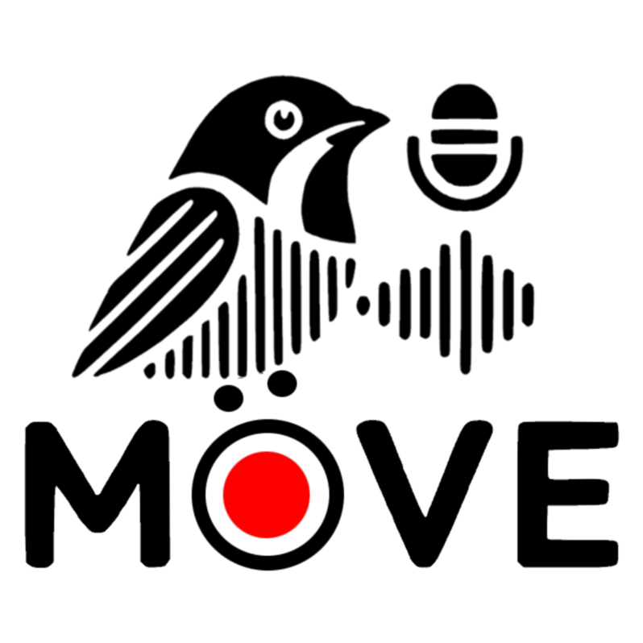

.. _introduction:

Introduction
============

|image1|

   **Moove** (Marking Online using Only the Onsets of Vocal Elements) is a novel tool for real-time syllable segmentation and classification of birdsong, designed to enable closed-loop experiments in vocal learning research. Designed to study the learned vocalisations of Bengalese finches, Moove identifies target syllables in a bird's song and provides feedback in real time. Moove provides an out-of-the-box, neural network-based approach to reliably target vocal syllables before their end, enabling a reinforcement protocol where a specific syllable can be targeted with aversive white noise or an alternative feedback stimulus if adjusted.

   **Moove** uses a two-stage architecture: a convolutional-based encoder that segments syllables in the audio signal and a CNN classifier that assigns each detected syllable segment a label, identifying its type based on the initial part of its structure. This design allows Moove to operate at a lower audio chunk duration than other tools, enabling faster and more accurate syllable recognition with minimal latency. Moove includes a GUI for creating training datasets using unsupervised methods and training the networks, as well as a recording script for real-time syllable targeting.

Authors: Franziska Heubach, Jacqueline Göbl, Nils Riekers

The following pages will provide you with guided explanations for using MooveTaf and MooveGUI. Following the instructions step-by-step should give you a nice introduction into all possible ways to use Moove.
If you haven't done so yet, please check out our paper for more details: https://doi.org/10.64898/2025.12.19.695629

If you find yourself having any questions unanswered or you want to share suggestions, feel free to check out our Github: https://github.com/veitlab/moove

or contact us directly (lena.veit@uni-tuebingen.de).\ |image2|

