.. _moovegui:

MooveGUI
========

The MooveGUI will let you work with your data, train networks on your segments and thereby classify the syllables in your songs. The MooveGUI can be started via Windows PowerShell using the command **moovegui.exe**.

|image12|

.. _setting-the-config-1:

Setting the config
------------------

Once you recorded data using MooveTaf, the folder ``.moove`` will be created, which contains your recorded data and trained models (see also section *MooveTaf - Baseline Recordings*). 
This folder also contains your ``config.ini`` file, which can be opened and edited using any text editor program. In the section [GUI] 
you can set parameters for the MooveGUI. It is recommended to first start and look at the GUI for once and then come back to setting up the parameters as desired. 
The main window of the GUI is described in more detail in the section *Main window* below.

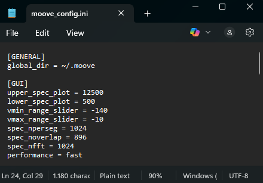

   Config settings for the MooveGUI

The parameters that can be set in the config are described in the table below (Table 2).

.. table:: Config settings for the MooveGUI

   +--------------------+-------------------+-----------------------------------------------------------------------------------------------------------------------------------------------------------------------------------------------+
   | **Parameter**      | **Default Value** | **Description**                                                                                                                                                                               |
   +====================+===================+===============================================================================================================================================================================================+
   | upper_spec_plot    | 12500             | Upper frequency limit of the spectrogram shown in the main window of the GUI                                                                                                                  |
   +--------------------+-------------------+-----------------------------------------------------------------------------------------------------------------------------------------------------------------------------------------------+
   | lower_spec_plot    | 500               | Lower frequency limit of the spectrogram shown in the main window of the GUI                                                                                                                  |
   +--------------------+-------------------+-----------------------------------------------------------------------------------------------------------------------------------------------------------------------------------------------+
   | vmin_range_slider  | -140              | Lower limit of the sliders to adjust the visual parameters of the spectrogram                                                                                                                 |
   +--------------------+-------------------+-----------------------------------------------------------------------------------------------------------------------------------------------------------------------------------------------+
   | vmax_range_slider  | -10               | Lower limit of the sliders to adjust the visual parameters of the spectrogram                                                                                                                 |
   +--------------------+-------------------+-----------------------------------------------------------------------------------------------------------------------------------------------------------------------------------------------+
   | spec_nperseg       | 1024              | Defines the length of each segment for the STFT (short-time fourier transform). Shorter values lead to a better time, but a poorer frequency resolution.                                      |
   +--------------------+-------------------+-----------------------------------------------------------------------------------------------------------------------------------------------------------------------------------------------+
   | spec_noverlap      | 896               | Specifies the number of points to overlap between segments in the STFT. The smaller, the less continuous the frequency information is displayed.                                              |
   +--------------------+-------------------+-----------------------------------------------------------------------------------------------------------------------------------------------------------------------------------------------+
   | spec_nfft          | 1024              | Sets the number of points for the FFT (fast fourier transform) computation, determining the frequency resolution. Smaller values lead to a lower frequency resolution, calculation is faster. |
   +--------------------+-------------------+-----------------------------------------------------------------------------------------------------------------------------------------------------------------------------------------------+
   | performance        | fast              | Defines how the spectrogram in the GUI is calculated. fast: more bleeding (imshow) vs slow: more details but slower (pcolomesh)                                                               |
   +--------------------+-------------------+-----------------------------------------------------------------------------------------------------------------------------------------------------------------------------------------------+

Main window
-----------

With the first-time start, an example file containing a labelled song bout will open (``bout_1.wav``). 
The upper plot of the GUI shows the **spectrogram** of the song file (①) and the lower plot the corresponding 
**amplitude trace** (②). 
The axis in between contains syllable **labels** (③) and will be empty if data has not been labeled yet. 
On the right you can find a slider to 
adjust the visual parameters of your spectrogram. The minimum and maximum range can be set in the config 
(see section *Setting the config*) and when adjusted 
manually the current slider settings will be saved when closing the GUI.

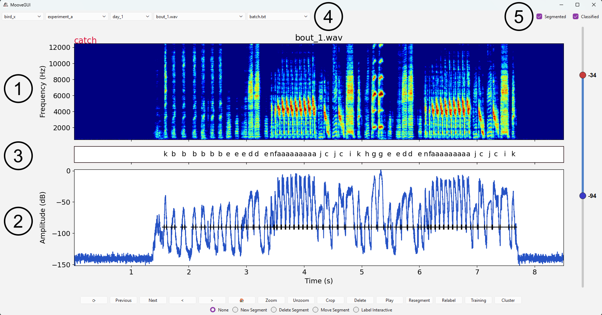

   Main window of the MooveGUI

The top of the GUI contains a **navigation bar** (④), representing the current working path in your recorded data (*rec_data*), 
meaning bird folder (*bird_x*), experiment folder (*experiment_a*), day folder (*day_1*) and song file (*bout_1.wav*). 
In addition, the most-right drop-down menu shows the current batch file you’re working on (by default *batch.txt*).

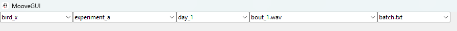

   Navigation bar in the main window

The bottom row of the GUI contains multiple functional buttons to work on the current file. The **update** button ‘\ **⟳**\ ’ (①) refreshes the GUI applying any changes performed on data folders and .rec files 
and updates each batch file. In case you are recording with MooveTaf on the same computer while working in the GUI, you can also press update to load your recently recorded files. 
The ‘\ **Previous**\ ’ and ‘\ **Next**\ ’ buttons (②) enable switching between song files of one day. In case the file you are loading next contains a lot of data, 
the loading process might take a few seconds. The arrow buttons ‘\ **<**\ ’ and ‘\ **>**\ ’ (③) let you move within the song file along the x-axis, which is especially helpful when zoomed in.

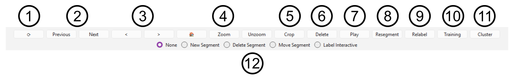

   Bottom row of the main window containing functional buttons

**Zooming** can be performed on either the spectrogram or the amplitude trace plot by dragging your cursor and will be signaled by a red box. 
A rather unspecific zoom into the data can be performed using the ‘\ **Zoom**\ ’ button and ‘\ **Unzoom**\ ’ reverts that in the same amount,
while ‘\ **🏠**\ ’ moves back to default, showing the whole file (④). 

.. note::
    **Zoom** reduces the x-axis range by 30% and **Unzoom** increases it by the same amount, 
    staying around the center of your current axis.

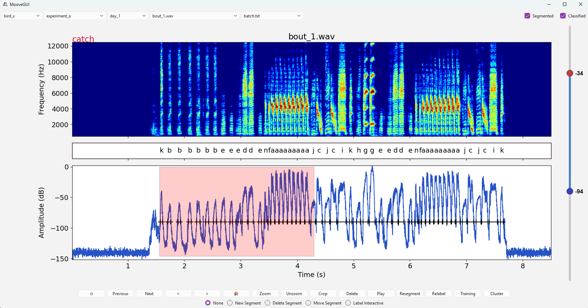

   Zooming

Once you zoomed in, you can ‘\ **Crop**\ ’ (⑤) your file to the currently shown x-axis range. Before cropping up the area, you will be asked to confirm the operation, as this will **delete** any excess data. 
The file names will not be changed but the title in the ``.rec`` file will display the date when the file was changed.

In case you want to delete the current file (for example noise files), the ‘\ **Delete**\ ’ button (⑥) will give you the option to either remove its entry from the current batch (blue box) or remove its .wav-file, 
.rec-file and .not.mat-file from the current folder (red box). **Note that this option will remove the file completely from your disk!**

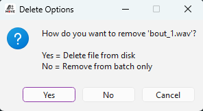

   File delete options

The GUI will move on to the next file. In case you deleted the file from your disk, to remove the file entry from all your batch-files, simply press the **update** button. 
If you are working on the default batch file ``batch.txt``, deleting the file 'from batch only’ will not delete it permanently from this batch, 
as restarting the GUI will refill the ``batch.txt`` file with every existing ``.wav`` file in the folder. 
When working on the ``batch.txt`` file, only the option ‘Delete file from disk’ will permanently delete it from this batch file. 
In any other batch file removal from the batch will be permanent.

The ‘\ **Play’** button will play back the sound of the current file (⑦). This playback process cannot be stopped, so if you want to listen to a specific part of a long sound file, 
consider zooming in on the relevant section first. It will only play the data currently shown.

The buttons ‘\ **Resegment**\ ’, ‘\ **Relabel**\ ’, ‘\ **Training**\ ’ and ‘\ **Cluster**\ ’, as well as the options below (⑧ ⑨ ⑩ ⑪), are used to train networks and classify syllables 
and will be explained in detail in the following chapters, including the usage of the upper right check boxes in the main window.

It is highly recommended to close the GUI using the **‘X’** in the upper right corner, as this will save all your current settings, 
including the current file number and slider settings. If any processes are still running in the background the MooveGUI will ask you if you are sure to close despite the running threads. 
However, after using the DashGUI (see section *Label Clustering*) and closing the DashGUI via the ‘Close Dash GUI’ button in the Cluster Window, MooveGUI has still pending threads open and the confirmation window opens.

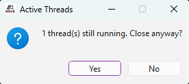

   Active thread warning

.. note::
   In case you ever encounter an error when starting the GUI, such that it won’t open at all, head to your .moove folder and delete the app_state.json file. 
   This should only be done if needed, as the index of the file you’re currently working on, as well as the slider settings will be set to default. 
   However, all your immediate changes to a file, such as onset/ offset modification etc., will still be saved!

Syllable segmentation
----------------------

Segmenting a file
~~~~~~~~~~~~~~~~~

In the first step of the data preprocessing pipeline, the individual syllables in each bout of the raw audio data need to be segmented. 
The ‘\ **Resegment’** button in the main window of the GUI (*Main window* ⑧) will open the *Resegmentation window*. 

On the left side of the window (red box), 
the segmentation method provided by *evfuncs* (Nicholson, 2021) is implemented. The four radio buttons *Current File, Current Day, Current Experiment and Current Bird* 
let you decide which files the segmentation method should be applied to. This is done relative to the currently selected file. Selecting the *Current Day* button will use all the files 
in the directory of the currently selected day, selecting the *Current Experiment* or *Current Bird* button ensures that all files in the respective subdirectories are used. 
For every selection, the respective **batch files** will become visible in the drop-down menu on the right (blue box). By default, *All files* from the respective directory will be used. 
Choosing a specific batch file in the menu will only feed files from this batch into the dataset. With that, you have the option to load specific files from multiple days or experiments. 
You can also perform segmentation solely on the *Current File*.

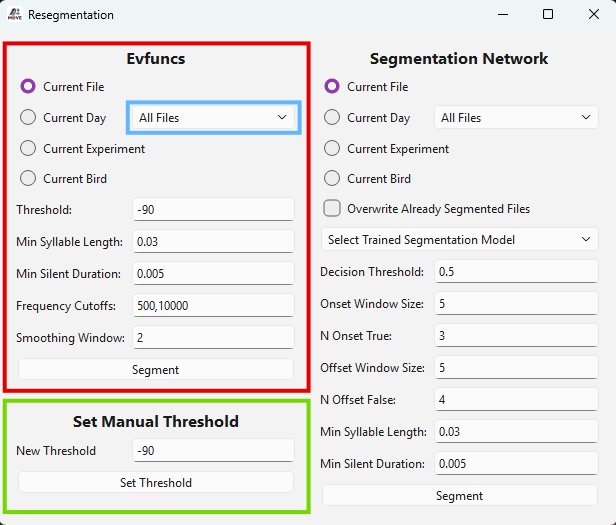

   Resegmentation window, segmenting files using evfuncs

For the segmentation process, you can define five parameters that are explained in the table below. Each parameter has a given default value. 
Pressing the button ‘\ **Segment**\ ’ will start the segmentation process with the given parameters on the selected file(s), indicated by a green progress bar 
at the bottom of the window. This will determine syllable onsets and offsets in the raw audio data.
Closing the *Resegmentation window* while the process is still running will open a window asking whether you want to stop segmenting or not. Pressing **Yes** 
will stop the process and the syllable onsets and offsets determined by the algorithm up to this point will be saved.

.. table:: Resegmentation parameters for using evfuncs

   +-------------------------+----------------------+------------------------------------------------------------------------------------+
   | **Parameter**           | **Default Value**    | **Description**                                                                    |
   +=========================+======================+====================================================================================+
   | Threshold               | 10 [Decibel]         | Defines the threshold for detecting amplitude peaks as part of a syllable segment. |
   +-------------------------+----------------------+------------------------------------------------------------------------------------+
   | Min Syllable Duration   | 0.03 [seconds]       | Sets the minimum duration of a syllable that a syllable segment must have.         |
   +-------------------------+----------------------+------------------------------------------------------------------------------------+
   | Min Silent Duration     | 0.005 [seconds]      | Sets the minimum silence between two syllables to be counted as separate units.    |
   +-------------------------+----------------------+------------------------------------------------------------------------------------+
   | Frequency Cutoffs       | (500, 10000) [Hertz] | Determines the lower and upper cutoff frequencies of the bandpass filter.          |
   +-------------------------+----------------------+------------------------------------------------------------------------------------+
   | Smoothing Window        | 2 [milliseconds]     | Defines the size of the time window for smoothing the signal.                      |
   +-------------------------+----------------------+------------------------------------------------------------------------------------+

Once the process is done, you will be informed. 
The syllable onsets and offsets assigned by the algorithm will become visible in the amplitude trace of the main window. 
Each segment will be labeled ‘**x**’ by default, visible in the middle plot. Furthermore, onset and offset times will be added to the .not.mat-file 
of each song file the segmentation has been performed on. If you want to visibly move your segments **without changing the onset and offset times in the .not.mat-file**, 
you can use the option **Set Threshold Manually** in the *Resegmentation window* (green box). Setting a new threshold and pressing the button will move the segments 
to the positions determined by the new threshold, but the original onset and offset times will be kept in the ``.not.mat`` file.

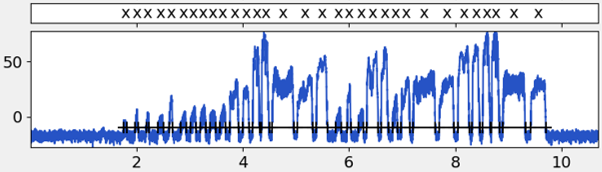

   Segmentation of a file

The algorithm-driven segmentation might not be entirely accurate; thus, you can adjust your segments using the *segmentation bar* (*Main window* ⑫). 
The options **New Segment** (shortcut “n”), **Delete Segment** (shortcut “d”) and **Move Segment** (shortcut “m”) are implemented as a group 
of radio buttons on the lower control bar of the GUI. Each option of the bar can be accessed via a shortcut, by simply pressing the respective button on the keyboard. 
Switching to that option will become visible in the bar. The option **Label Interactive** is part of the classification process and will be explained later.

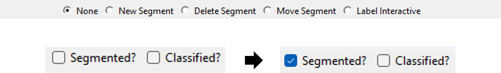

   Segmentation bar in the Main window, marking files as segmented/ classified

If the **New Segment** option is selected, a syllable segment can be added with a left click for the onset and a right click for the offset in the area of the amplitude diagram. 
This segment is then temporarily labelled with the placeholder value ‘x’. Selecting the **Delete Segment** option allows you to delete an existing syllable segment in the amplitude 
diagram by clicking on it. You can also click on the corresponding label to delete it. The **Move Segment** option allows the user to left-click on the marker of an existing onset or 
offset point in the amplitude diagram. The marker will be highlighted in red. A right-click on the desired position will move it to this new position. You can mark files for which 
you have manually verified the segmentation using the **Segmented** checkbox in the upper right corner of the main window (see *Main window* ⑤). 
This will in the following steps give you the option to specifically train a network based on previous segmentation. 
This information will be saved in the corresponding ``.rec`` file of the current song file.

Create a Segmentation Training Dataset
~~~~~~~~~~~~~~~~~~~~~~~~~~~~~~~~~~~~~~

As soon as enough bouts have been segmented, the segmentation network can be trained. Training the network is recommended to be an **iterative process**. 
Therefore, few bouts are first segmented manually, and the segmentation network is trained. The trained network can then be used to segment 
a bout that has not been segmented yet. 
Even if the segmentation of this bout is not yet perfect, the corresponding bout can then be corrected more quickly by hand 
and included in the set of bouts for the training dataset. 
By that, you can train the network on more and more hand-corrected segmented files. 
To create a training dataset out of your segmented files, press the ‘\ **Training’** button (see *Main window* ⑩) 
in the GUI main window to open the *Training window*.

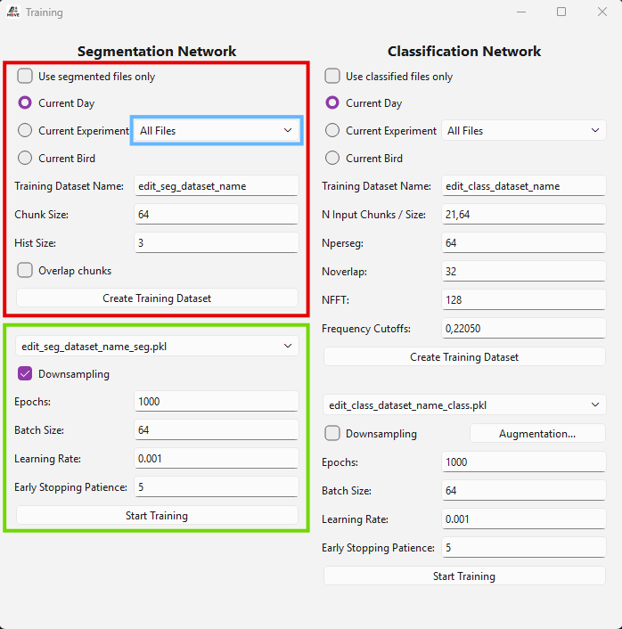

   Creating a segmentation training dataset

The left part of the window is dedicated to the **segmentation network**, with the upper part enabling the creation of a training dataset (red box). 

With the upper four buttons you can choose which files to feed into the dataset. The options *Current Day*, *Current Experiment* and *Current Bird* will use all files in the respective subdirectories. 
For every selection, the respective **batch files** will become visible in the drop-down menu on the right (blue box). By default, *All files* from the respective directory will be used. 
Choosing a specific batch file in the menu will only feed files from this batch into the dataset. With that, you have the option to load specific files from multiple days or experiments. 
The option *Use Segmented Files Only* creates a dataset only containing the files in which the *segmentation checkmark* has been ticked (see above). 
This gives you the option to only feed files into the dataset that have already been manually checked or corrected. 

.. note::
      You must assign a name to the dataset in the *Training Dataset Name* field, the suffix *\_seg* will be added automatically. You cannot create empty datasets.

The *Chunk Size* field below defines the step size of how many audio samples are fed to the segmentation network during inference (default value = “64”). This enables the segmentation network a fast detection of onsets, 
as the duration of each audio chunk is about 1.45ms using a sampling rate of 44.1kHz. The input field named *Hist Size* specifies how many previous audio chunks are added during the inference 
of a new audio chunk in the segmentation network (default value = 3). The checkbox *Overlap Chunks* determines whether successive sequences of chunks should overlap in the training dataset. 
If selected, each new sequence is created containing chunks of the previous sequence. This will enlarge the training dataset as more overlapping data points are generated from the audio data. 
If the parameter is not selected, the sequences are created without overlapping so that each sequence is independent of the previous one. To avoid data leakage, this option should only be set 
if you feed **at least** **7** segmented files into the network.

Pressing the button **Create Training Dataset** will start the process, 
indicated as ‘\ *Looking for Segments*\ ’ and followed by a green progress bar at the bottom of the window. Closing the *Resegmentation window* while the process is 
still running will open a window asking whether you want to stop creating the dataset or not. Pressing **Yes** will stop the process and the 
training dataset will not be created.
Once the dataset is created you will be informed. 
With that, the content of the dataset, *Chunk Size* and *Hist Size* will be saved to a ``.pkl`` file in the folder *training_data*.

Train the Segmentation Network
~~~~~~~~~~~~~~~~~~~~~~~~~~~~~~

Once a segmentation training dataset is created, the segmentation network can be trained via the *Training window* (green box).

   Training of the segmentation network

In the drop-down menu *Select Training Dataset* you can choose between your previously created training datasets. 
The parameters that can be set to train the network are explained in the table below.

.. note::
      We do not recommend downsampling if you’re especially interested in ‘repeats’ or if your dataset contains syllables that only occur very rarely.
      For imbalanced datasets, **Weighted BCE** is an alternative that uses all training data while assigning higher loss to the minority class.

.. table:: Parameters for training the segmentation network

   +----------------------------+-------------------+------------------------------------------------------------------------------------------------------------------------------------------------------------------------------------+
   | **Parameter**              | **Default Value** | **Description**                                                                                                                                                                    |
   +============================+===================+====================================================================================================================================================================================+
   | Class imbalance            | Weighted BCE      | Strategy to handle class imbalance. **None**: no correction. **Downsampling**: undersample majority class to match minority class size. **Weighted BCE**: compute pos_weight =    |
   |                            |                   | n_negative / n_positive and pass to BCEWithLogitsLoss, so the minority class (syllable frames) receives proportionally higher loss. These options are mutually exclusive.          |
   +----------------------------+-------------------+------------------------------------------------------------------------------------------------------------------------------------------------------------------------------------+
   | Epochs                     | 1000              | Specifies the number of epochs for training the neural network.                                                                                                                    |
   +----------------------------+-------------------+------------------------------------------------------------------------------------------------------------------------------------------------------------------------------------+
   | Batch Size                 | 64                | Defines the number of samples that will be propagated through the network at once during training.                                                                                 |
   +----------------------------+-------------------+------------------------------------------------------------------------------------------------------------------------------------------------------------------------------------+
   | Learning Rate              | 0.001             | Controls the step size during the optimization process.                                                                                                                            |
   +----------------------------+-------------------+------------------------------------------------------------------------------------------------------------------------------------------------------------------------------------+
   | Early Stopping Patience    | 5                 | Sets the number of epochs without improvement of the validation data after which the training is terminated automatically. Higher early stopping patience can lead to overfitting. |
   +----------------------------+-------------------+------------------------------------------------------------------------------------------------------------------------------------------------------------------------------------+

The *Start Training* button will train the segmentation network on the files from the selected training dataset. 
The training window will indicate the status of the training at the bottom, starting with ‘\ *Checking files*\ ’ for usability, 
switching to ‘\ *Training in Progress’* once you confirmed the start by pressing ‘\ *Ok*\ ’ and finally informing you when the 
training is finished. Closing the *Resegmentation window* while the process is still running will open 
a window asking whether you want to stop training or not. Pressing **Yes** will stop the process and the network will not be trained.
The training progress can be observed in the terminal, where the current 
iteration of training (epoch) and the current accuracy of the network is shown.

.. attention::
   Training will only start once the button **Ok** is pressed.

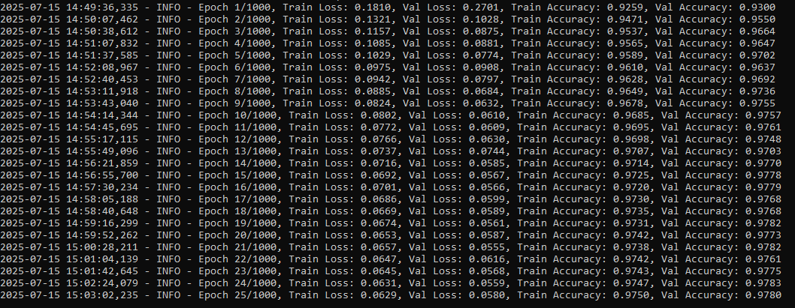

   Iterations of training the network

The trained model can be found as a ``.pth`` file in the *trained_models* directory.

To train a network, at least **8 segments** must be defined in the given files. Furthermore, if the dataset consists of at least **7 segmented files**, 
the data will be split between files to form the training data, validation data and test data set. Splitting data by files prevents data leakage and provides 
more reliable accuracy results. However, you can still train a network on less than 7 files, for example if you have very long song files containing multiple 
bouts and segments. The GUI will ask you whether you want to continue with only a few files.

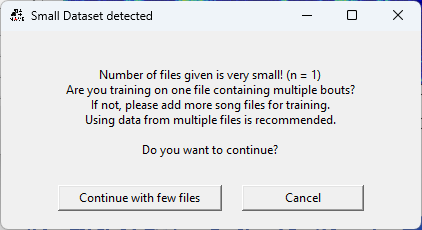

   Small dataset warning

Pressing **Continue with few files** will train a network on these files (if they contain at least 8 segments) by not splitting between files. 
Therefore, training data, validation data and test data sets will contain segments from the same file. This is in general not recommended and accuracy values can be less reliable. 
Pressing **Cancel** will bring you back to the *training window.*

Resegment using the Trained Network
~~~~~~~~~~~~~~~~~~~~~~~~~~~~~~~~~~~

Once you have trained your segmentation network, you can use it to segment files. For that purpose, open the *Resegmentation window* using the **Resegment** button in the main window. 
On the right half, the trained network can now be parameterized and applied (red box). 

Again, the options *Current File,* *Current Day*, *Current Experiment* and *Current Bird* 
let you choose which files to resegment. For every selection, the respective **batch files** will become visible in the drop-down menu on the right (blue box). By default, 
*All files* from the respective directory will be used. Choosing a specific batch file in the menu will only feed files from this batch into the dataset. With that, you have the option 
to load specific files from multiple days or experiments. 

With the tickbox *Overwrite Already Segmented Files* you can decide whether files that have already been manually segmented 
(and marked as *Segmented*, see above) should be overwritten and segmented by the network. **Ticking the box will enable resegmentation of these files.** 

In the drop-down menu *Select Trained Segmentation Model* 
you can select the desired trained segmentation model. Its content is generated from all saved segmentation models in the *trained_models* directory.

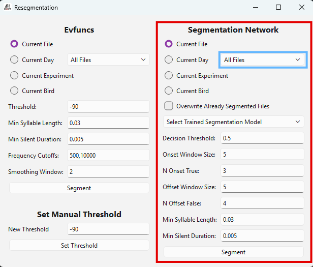

   Resegment using the training segmentation network

The resegmentation parameters can be adjusted below and are explained in the following table. Eventually, pressing the **Segment** button at the bottom of the window 
will start the resegmentation process of the selected files, indicated by a green progress bar at the bottom of the window. Once all files are resegmented, you will be informed.
Closing the *Resegmentation window* while the process is still running will open a window asking whether you want to stop segmenting or not. 
Pressing **Yes** will stop the process and the syllable onsets and offsets determined by the algorithm up to this point will be saved.

.. table:: Parameters for resegmenting using a trained network

   +---------------------+--------------------+--------------------------------------------------------------------------------------+
   | **Parameter**       | **Default Value**  | **Description**                                                                      |
   +=====================+====================+======================================================================================+
   | Decision Threshold  | 0.5 [%]            | Defines a probability threshold for detecting a syllable segment.                    |
   +---------------------+--------------------+--------------------------------------------------------------------------------------+
   | Onset Window Size   | 5 [chunks]         | Specifies the size of the sliding window used to detect onsets.                      |
   +---------------------+--------------------+--------------------------------------------------------------------------------------+
   | N Onset True        | 3 [chunks]         | Sets the number of *True* detections within the sliding window.                      |
   +---------------------+--------------------+--------------------------------------------------------------------------------------+
   | Offset Window Size  | 5 [chunks]         | Specifies the size of the sliding window used to detect offsets.                     |
   +---------------------+--------------------+--------------------------------------------------------------------------------------+
   | N Offset False      | 4 [chunks]         | Sets the number of *False* detections within the sliding window.                     |
   +---------------------+--------------------+--------------------------------------------------------------------------------------+
   | Min Syllable Length | 0.03 [seconds]     | Specifies the minimum duration of a syllable that a syllable segment must have.      |
   +---------------------+--------------------+--------------------------------------------------------------------------------------+
   | Min Silent Duration |    0.005 [seconds] | Specifies the minimum silence between two syllables to be counted as separate units. |
   +---------------------+--------------------+--------------------------------------------------------------------------------------+

Label Clustering
----------------

Create a Cluster Training Dataset
~~~~~~~~~~~~~~~~~~~~~~~~~~~~~~~~~

To obtain the syllable labels for the training dataset of the classification network, the dimensionality reduction method UMAP is used together with a clustering algorithm. 
The input for UMAP consists of the individual spectrograms of the identified syllable segments. For this purpose, a cluster dataset containing the spectrograms of the syllable segments 
needs to be created, which can be done in the *Cluster window*, available via the **Cluster** button in the main window (see *Main window*).

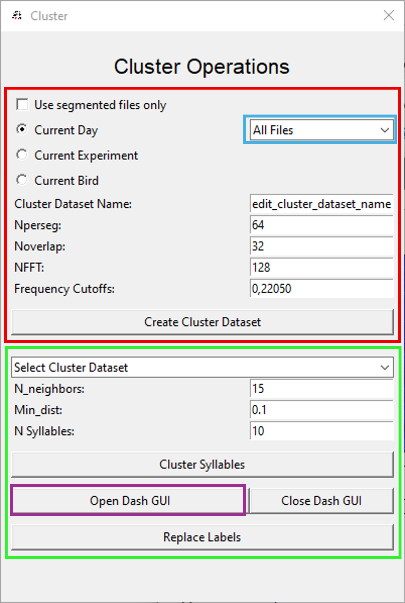

   Creating a cluster training dataset

In the upper part of the window (red box), the options *Current File, Current Day, Current Experiment* and *Current Bird* define the files the clusters will be created from. 
For every selection, the respective **batch files** will become visible in the drop-down menu on the right (blue box). By default, *All files* from the respective directory 
will be used. Choosing a specific batch file in the menu will only feed files from this batch into the dataset. With that, you have the option to load specific files from multiple days or experiments. 

The checkbox **Use segmented files only** targets only files that have already been manually segmented (and marked as *Segmented*, see above). 

You must assign a name in the *Cluster Dataset Name* field, 
the suffix *\_clus* will be added automatically. 

The following adjustable parameters will be used in the spectrogram calculation and are described in the table below.

.. table:: Parameters for creating a cluster dataset

   +-------------------+-------------------+-----------------------------------------------------------------------------------------------------------------------------------------------------------------------------------------------+
   | **Parameter**     | **Default Value** | **Description**                                                                                                                                                                               |
   +===================+===================+===============================================================================================================================================================================================+
   | Nperseg           | 64                | Defines the length of each segment for the STFT (short-time fourier transform). Shorter values lead to a better time, but a poorer frequency resolution.                                      |
   +-------------------+-------------------+-----------------------------------------------------------------------------------------------------------------------------------------------------------------------------------------------+
   | Noverlap          | 32                | Specifies the number of points to overlap between segments in the STFT. The smaller, the less continuous the frequency information is displayed.                                              |
   +-------------------+-------------------+-----------------------------------------------------------------------------------------------------------------------------------------------------------------------------------------------+
   | NFFT              | 128               | Sets the number of points for the FFT (fast fourier transform) computation, determining the frequency resolution. Smaller values lead to a lower frequency resolution, calculation is faster. |
   +-------------------+-------------------+-----------------------------------------------------------------------------------------------------------------------------------------------------------------------------------------------+
   | Frequency Cutoffs | 0,22050 [Hertz]   | Defines the lower and upper cutoff frequency for filtering the spectrogram.                                                                                                                   |
   +-------------------+-------------------+-----------------------------------------------------------------------------------------------------------------------------------------------------------------------------------------------+

Pressing the button Create Cluster Dataset will start the process, indicated by a green process bar at the bottom of the *Cluster window*. 
Once the clustering is done, you will be informed. The dataset will be saved as ``.pkl`` file in the *cluster_data* folder.
Closing the *Cluster window* while the process is still running will open a window asking whether you want to stop creating the dataset or not. 
Pressing **Yes** will stop the process and the cluster dataset will not be created.

Cluster Syllables
~~~~~~~~~~~~~~~~~~

Once the cluster dataset is created, the dimensionality reduction using UMAP can be started. For that, the created dataset can be selected in the lower part of the *Cluster window* (green box).

   Clustering of syllables

Below, the input parameters for the UMAP algorithm and the following k-Means algorithm can be set (Table 7). 
The button **Cluster Syllables** will start the process, indicated by the ‘\ *Running*\ ’ label at the bottom of the window.
Closing the *Cluster window* while the process is still running will open a window asking whether you want to stop clustering or not. 
Pressing **Yes** will stop the process and the syllables will not be clustered.

.. table:: Parameters for clustering syllables

   +---------------+-------------------+-------------------------------------------------------------------------------------------------------------------------------------------------------------+
   | **Parameter** | **Default Value** | **Description**                                                                                                                                             |
   +===============+===================+=============================================================================================================================================================+
   | N neighbors   | 15                | Determines the number of nearest neighbors *k* when constructing the high-dimensional graph.                                                                |
   +---------------+-------------------+-------------------------------------------------------------------------------------------------------------------------------------------------------------+
   | Min dist      | 0.1               | Controls the minimum distance between points in the low-dimensional space. A smaller value leads to denser clusters.                                        |
   +---------------+-------------------+-------------------------------------------------------------------------------------------------------------------------------------------------------------+
   | N Syllables   | 10                | Defines the number of syllable clusters to be formed for the k-Means algorithm. Re-adjust if the number of clusters created is not the yellow from the egg. |
   +---------------+-------------------+-------------------------------------------------------------------------------------------------------------------------------------------------------------+

Once the clustering is completed, the results will be saved to the ``.pkl`` file, together with a same-named ``.png`` file of the 2D UMAP space 
containing the syllable clusters. An interactive version of the UMAP clustering can be opened with the button 
**Open Dash GUI** (purple box), which will start in a separate thread in your browser.

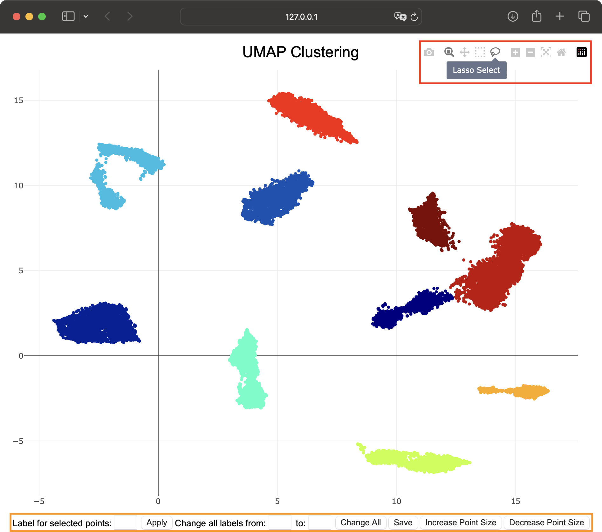

   Dash GUI containing your syllable clusters

Dash GUI
~~~~~~~~

Each colored cluster in the space represents one classified syllable type, each dot represents one syllable. 
The clusters will be labeled with letters, starting at ‘\ *a*\ ’. 
The Dash GUI offers multiple ways to interact with the data and to reassign the cluster membership of the data 
points as desired. In the tool bar located in the upper right corner (red box), 
you can activate the **zoom** tool (②) to closely inspect the data, **move** around (③) the plot or 
**zoom in and out** (⑥ + ⑦) more directly. The **autoscale** button (⑧) 
will move the plot to your clusters position and **reset axes** (⑨) will reset the plot. The **save** button (①) 
will save the plot as a ``.png`` file. 
Also, **double clicking** the plot will zoom out, autoscale to your clusters position and remove any existing 
selection boxes. To relabel specific data points, 
the option **Box Select** (④) lets you draw a box around a specific set of dots, and **Lasso Select** (⑤) lets 
you draw a free form.

   Options in the Dash GUI

Once you selected points, you can relabel these points directly by typing the new label into the *Label for selected points* field at the left bottom of the 
Dash window (orange box). 
Pressing the **Apply** button will change the label of the selected points and depending on the letter distance to the other syllables, the color space is adjusted, 
possibly leading to a different color mapping than before. Furthermore, you can change all dots from one label at once, by typing the current label of the cluster 
in the *Change all labels from* filed, 
and the new desired label in the *to:* field next to it. Pressing **Change All** will change the label of this cluster. In the lower right corner, the buttons 
**Increase Point Size** and **Decrease Point Size** 
give you the option to change the dot size for better visibility. When you applied your desired changes, press the **Save** button in the middle bottom part of the 
Dash GUI to overwrite your previous cluster data. 
Saving the data will be indicated by a message showing up in the MooveGUI. Once you’re done, press the **Close Dash GUI** button in the *Cluster window* of the MooveGUI. 
This will shut down the Dash server and you can then close the browser window. 

.. note::
   The Dash GUI **must be closed** using the **Close Dash GUI** button before it can be reopened, as the server will not be available otherwise.

Finally, you can apply your newly acquired syllable labels to your data by pressing the button **Replace Labels** in the *Cluster window*. 
This will replace all previous placeholder labels ‘x’ (or other labels) 
in the ``.not.mat`` files that have been fed into the dataset (as defined in *Create a Cluster Training Dataset*) 
and the new labels will appear in the GUI. Closing the *Cluster window* while the process is still running will open 
a window asking whether you want to stop replacing labels or not. Pressing **Yes** will stop the process and the labels will be 
replaced up to this point only.

Syllable classification
-----------------------

Create a Classification Training Dataset
~~~~~~~~~~~~~~~~~~~~~~~~~~~~~~~~~~~~~~~~

Although the classification by the process with UMAP, k-Means and a following manual adjustment of the cluster memberships is very accurate, 
individual syllables can be classified incorrectly. You can semi-manually review all files and correct any mislabelled syllables using the *Label Interactive* option in the main window (see *Main window*). 
To do so, clicking on the label you want to change will highlight it in red, and typing on your keyboard will replace it. Valid label characters are basic letters and numbers 
(no capital letters and special characters). After relabeling one syllable, the highlight jumps to the next syllable, enabling continuous relabeling till the end of the file. 
Corrected labels get automatically saved in the ``.not.mat`` file of the corresponding bout. Analogous to the procedure for the segmentation network, you can use the **Classified** 
checkbox in the top right corner (5, see above) to mark these files. This information will be saved in the corresponding ``.rec`` file of the current song file. 

.. note::
   While you are in the *Label interactive* mode, using shortcuts to switch modes is not possible, as the keys will be used for relabelling.
.. hint::
   You can jump inbetween labels using the arrow keys.

Once you all labels are correct, a training dataset can be created in the right upper part of the *training window* (red box) under classification network.
With the upper four buttons you can choose which files to feed into the dataset. The options *Current Day*, *Current Experiment* and *Current Bird* 
will jump to the respective folder direction and load all batch files found in those. For every selection, the respective **batch files** will become visible 
in the drop-down menu on the right (blue box). By default, *All files* from the respective directory will be used. Choosing a specific batch file in the menu 
will only feed files from this batch into the dataset. With that, you have the option to load specific files from multiple days or experiments. 

The option *Use Classified Files Only* creates a dataset only containing the files in which the *classification checkmark* has been ticked (see above). 
This gives you the option to only feed files into the dataset that have already been manually checked or corrected. 

You must assign a name to the dataset 
in the *Training Dataset Name* field, the suffix *\_class* will be added automatically.

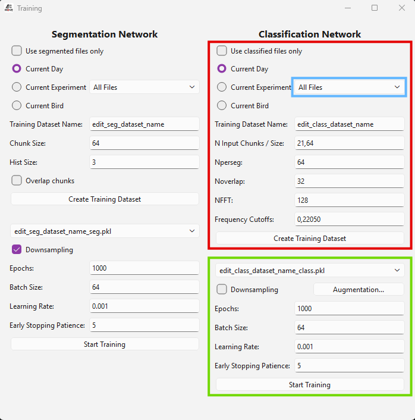

   Creating a classification training dataset

The training dataset for the classification network is generated from the spectrogram data of the individual syllable segments and their corresponding syllable label. 
For the classification network, only a fixed time interval after a detected onset is used as input (*N Input Chunks/Size*). This parameter can be set below among others, 
as described in the table below (Table 8). You cannot create empty datasets.

.. table:: Parameters for creating a classification training dataset

   +---------------------+-------------------+-----------------------------------------------------------------------------------------------------------------------------------------------------------------------------------------------+
   | **Parameter**       | **Default Value** | **Description**                                                                                                                                                                               |
   +=====================+===================+===============================================================================================================================================================================================+
   | N Input Chunks/Size | 21,64             | Length of time interval after onset that is used as input for classification (~30.48 ms at 44.1kHz)                                                                                           |
   +---------------------+-------------------+-----------------------------------------------------------------------------------------------------------------------------------------------------------------------------------------------+
   | Nperseg             | 64                | Defines the length of each segment for the STFT (short-time fourier transform). Shorter values lead to a better time, but a poorer frequency resolution.                                      |
   +---------------------+-------------------+-----------------------------------------------------------------------------------------------------------------------------------------------------------------------------------------------+
   | Noverlap            | 32                | Specifies the number of points to overlap between segments in the STFT. The smaller, the less continuous the frequency information is displayed.                                              |
   +---------------------+-------------------+-----------------------------------------------------------------------------------------------------------------------------------------------------------------------------------------------+
   | NFFT                | 128               | Sets the number of points for the FFT (fast fourier transform) computation, determining the frequency resolution. Smaller values lead to a lower frequency resolution, calculation is faster. |
   +---------------------+-------------------+-----------------------------------------------------------------------------------------------------------------------------------------------------------------------------------------------+
   | Frequency Cutoffs   | 0,22050 [Hertz]   | Defines the lower and upper cutoff frequency for filtering the spectrogram.                                                                                                                   |
   +---------------------+-------------------+-----------------------------------------------------------------------------------------------------------------------------------------------------------------------------------------------+

Pressing the button **Create Training Dataset** will start the process, indicated as ‘\ *Looking for Syllables’* and followed by a 
green progress bar at the bottom of the window. 
Once the dataset is created you will be informed. With that, the content of the dataset will 
be saved to a ``.pkl`` file in the *training_data* folder. 
Closing the *Training window* while the process is still running will open a window asking whether you want to stop creating the dataset or not. 
Pressing **Yes** will stop the process and the training dataset will not be created.

Training the Classification Network
~~~~~~~~~~~~~~~~~~~~~~~~~~~~~~~~~~~

Once a classification training dataset is created, the classification network can be trained via the *Training window* (green box).

   Training the classification network

In the drop-down menu *Select Training Dataset* you can choose between your previously created training datasets. 
The parameters that can be set to train the network are explained in the table below.

.. note::
      We do not recommend downsampling if you’re especially interested in ‘repeats’ or if your dataset contains syllables that only occur very rarely.
      For imbalanced datasets, **Weighted Loss** is an alternative that uses all training data while assigning higher loss to under-represented syllable types.

.. table:: Parameters for training the classification network

   +-------------------------+-------------------+------------------------------------------------------------------------------------------------------------------------------------------------------------------------------------+
   | **Parameter**           | **Default Value** | **Description**                                                                                                                                                                    |
   +=========================+===================+====================================================================================================================================================================================+
   | Class imbalance         | Weighted Loss     | Strategy to handle class imbalance. **None**: no correction. **Downsampling**: undersample majority classes to the minority class size. **Weighted Loss**: compute per-class       |
   |                         |                   | weights (n_total / (n_classes × count_c)) and pass to CrossEntropyLoss, so rare syllable types receive higher loss. These options are mutually exclusive.                         |
   +-------------------------+-------------------+------------------------------------------------------------------------------------------------------------------------------------------------------------------------------------+
   | Epochs                  | 1000              | Specifies the number of epochs for training the neural network.                                                                                                                    |
   +-------------------------+-------------------+------------------------------------------------------------------------------------------------------------------------------------------------------------------------------------+
   | Batch Size              | 64                | Defines the number of samples that will be propagated through the network at once during training.                                                                                 |
   +-------------------------+-------------------+------------------------------------------------------------------------------------------------------------------------------------------------------------------------------------+
   | Learning Rate           | 0.001             | Controls the step size during the optimization process.                                                                                                                            |
   +-------------------------+-------------------+------------------------------------------------------------------------------------------------------------------------------------------------------------------------------------+
   | Early Stopping Patience | 5                 | Sets the number of epochs without improvement of the validation data after which the training is terminated automatically. Higher early stopping patience can lead to overfitting. |
   +-------------------------+-------------------+------------------------------------------------------------------------------------------------------------------------------------------------------------------------------------+

.. attention:: Make sure you enable or disable augmentation in the **Augmentation...** window.

Data Augmentation
^^^^^^^^^^^^^^^^^

To improve generalization and reduce overfitting, data augmentation can be applied during classification training.
The **Augmentation...** button next to the class imbalance options opens a configuration dialog where augmentation
can be enabled or disabled and the individual parameters can be adjusted.

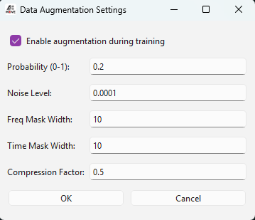

   Augmentation window

When enabled, each training spectrogram has a configurable probability (default 20%) of being augmented per epoch.
For each augmented sample, one of the following four transformations is randomly selected and applied:

- **Additive Gaussian Noise** — Adds random noise drawn from a normal distribution scaled by the *Noise Level* parameter. This simulates microphone noise and recording variability.
- **Frequency Masking** — Zeros out a contiguous band of frequency bins (width up to *Freq Mask Width*), inspired by SpecAugment (Park et al., 2019). This encourages the network to not rely on narrow frequency bands.
- **Time Masking** — Zeros out a contiguous block of time frames (width up to *Time Mask Width*), analogous to frequency masking along the time axis.
- **Dynamic Range Compression** — Applies logarithmic compression via :math:`\log(1 + c \cdot (e^x - 1))` with *Compression Factor* :math:`c`, reducing the dynamic range of the spectrogram.

The augmentation parameters are described in the table below.

.. table:: Data augmentation parameters for classification training

   +---------------------+-------------------+---------------------------------------------------------------------------------------------------------------------------------------------------+
   | **Parameter**       | **Default Value** | **Description**                                                                                                                                   |
   +=====================+===================+===================================================================================================================================================+
   | Enable Augmentation | True              | Enables or disables data augmentation during training.                                                                                            |
   +---------------------+-------------------+---------------------------------------------------------------------------------------------------------------------------------------------------+
   | Probability         | 0.2               | Probability that a given spectrogram is augmented in each training epoch. A value of 0.2 means 20% of samples are augmented on average.           |
   +---------------------+-------------------+---------------------------------------------------------------------------------------------------------------------------------------------------+
   | Noise Level         | 0.0001            | Standard deviation of the Gaussian noise added to the spectrogram.                                                                                |
   +---------------------+-------------------+---------------------------------------------------------------------------------------------------------------------------------------------------+
   | Freq Mask Width     | 10 [bins]         | Maximum width (in frequency bins) of the frequency mask.                                                                                          |
   +---------------------+-------------------+---------------------------------------------------------------------------------------------------------------------------------------------------+
   | Time Mask Width     | 10 [frames]       | Maximum width (in time frames) of the time mask.                                                                                                  |
   +---------------------+-------------------+---------------------------------------------------------------------------------------------------------------------------------------------------+
   | Compression Factor  | 0.5               | Controls the strength of dynamic range compression. Lower values produce stronger compression.                                                    |
   +---------------------+-------------------+---------------------------------------------------------------------------------------------------------------------------------------------------+

Augmentation settings are persisted across sessions and are also saved in the trained model checkpoint, ensuring reproducibility.

.. note::
   Data augmentation is only applied to the **classification network** (CNN) which operates on 2D spectrograms. The segmentation network (ConvMLP) operates 
   on raw 1D audio chunks where these spectral augmentations would not be meaningful.

The *Start Training* button will train the classification network on the files from the selected training dataset. 
The *Training window* will indicate the status of the training at the bottom, starting with ‘\ *Checking files*\ ’ for usability, 
switching to ‘\ *Training in Progress’* once the training has started 
and finally informing you when the training is finished. Closing the *Training window* while the process is still running will open a window asking whether 
you want to stop training or not. Pressing **Yes** will stop the process and the trained model will not be saved.

.. attention::
   Training will only start once the button **Ok** is pressed.. 

The trained model can be found as a ``.pth`` file in the *trained_models* directory, 
together with a ``.svg`` file containing the classification matrix. This matrix shows the performance of the network as the accuracy of 
the predictions for each type of syllable on the test subset.

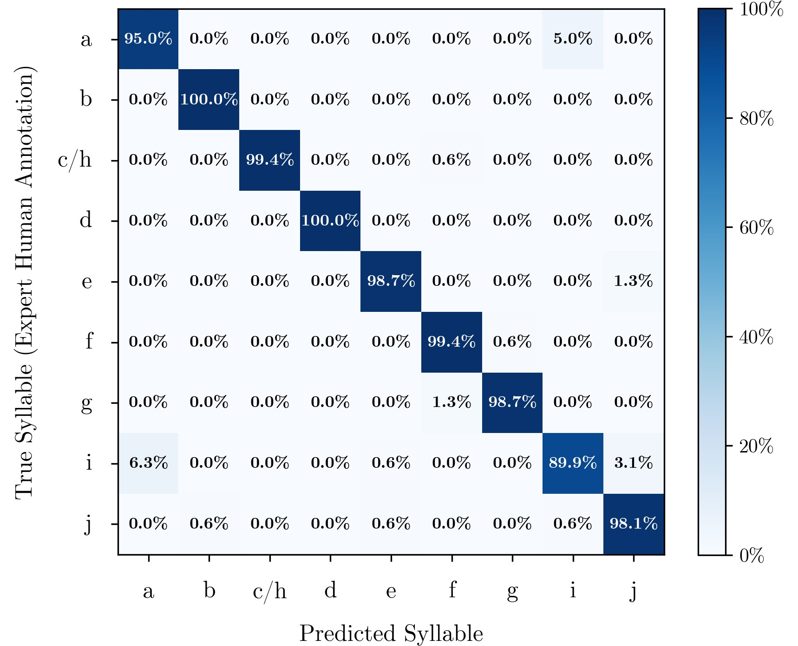

   Example classification matrix

To train a network, at least **6 syllables per syllable type** must be defined in the given files. Furthermore, if the dataset consists of at least **7 classified files**, 
the data will be split between files to form the training data, validation data and test data set. 
Splitting data by files prevents data leakage and provides more reliable accuracy results. 
However, you can still train a network on less than 7 files, for example if you have very long song files containing multiple bouts and syllables. 
The GUI will ask you whether you want to continue with only a few files.

   Small dataset warning

Pressing **Continue with few files** will train a network on these files (if they contain at least 6 syllables per syllable type) by not splitting between files. 
Therefore, training data, validation data and test data sets will contain syllables from the same file. This is in general not recommended and accuracy values 
can be less reliable. Pressing **Cancel** will bring you back to the *training window.*

Relabel Data
~~~~~~~~~~~~

Lastly, you can apply your trained classification network on already labeled data by opening the *Relabel window* using the **Relabel** 
button in the main window (see *Main window*). 

Again, the four upper buttons define which files should be relabeled by going into the respective subdirectories, including the selection 
of a specific batch file (blue box). 
By default, *All Files* of your selection will be used. With the tickbox *Overwrite Already Segmented Files* you can decide whether files 
that have already been manually classified (and marked as *Classified*, see above) 
should be overwritten and classified by the network. **Ticking the box will enable relabeling of these files.** 

In the drop-down menu *Select Trained Classification Model* you can select the desired trained classification model. 
Its content is generated from all saved classification models in the *trained_models* directory. When pressing the **Relabel** button, 
the replacement of labels will be started indicated by a green progress bar 
at the bottom of the *Relabel* window. Once all labels are replaced, you will be informed. 
Closing the *Relabel* window while the process is still running will open a window asking whether you want to stop relabeling or not. 
Pressing **Yes** will stop the process and the labels will be replaced up to this point only.

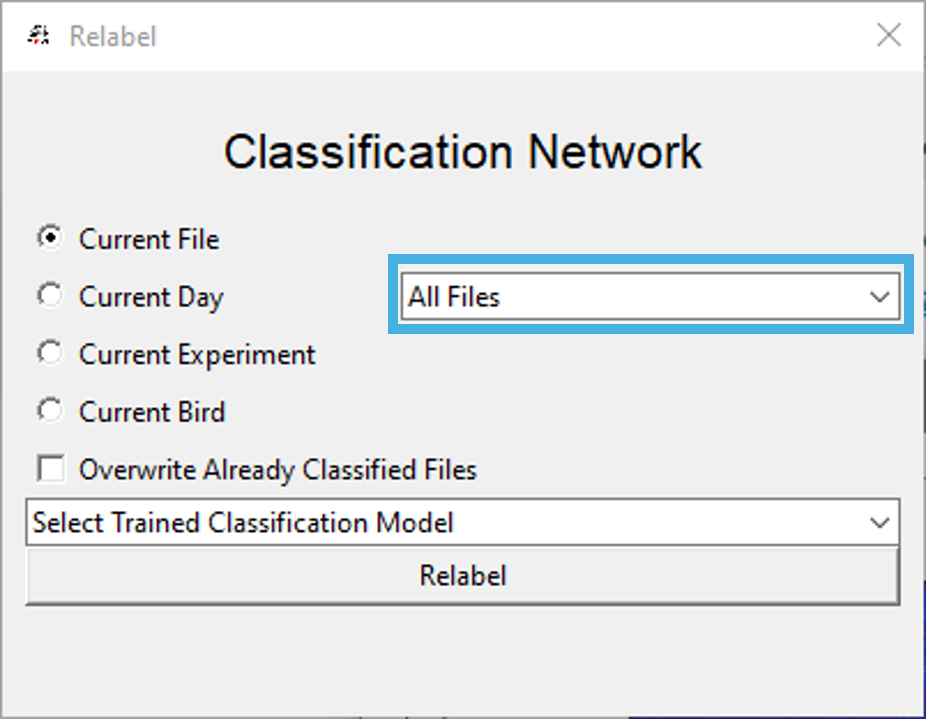

   Relabel data using the classification network

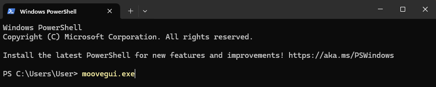

