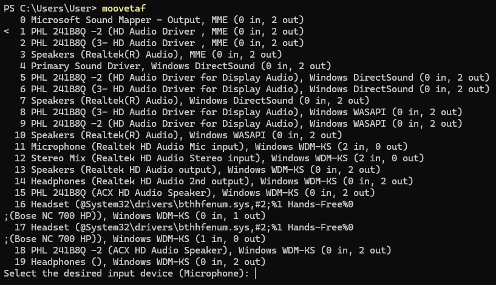
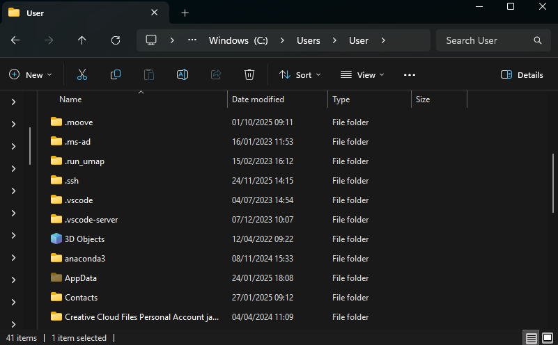
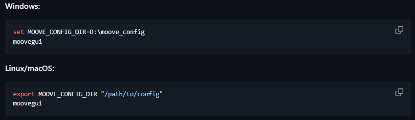
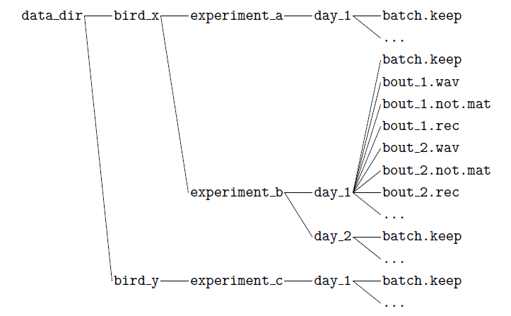
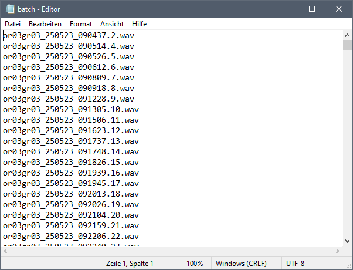
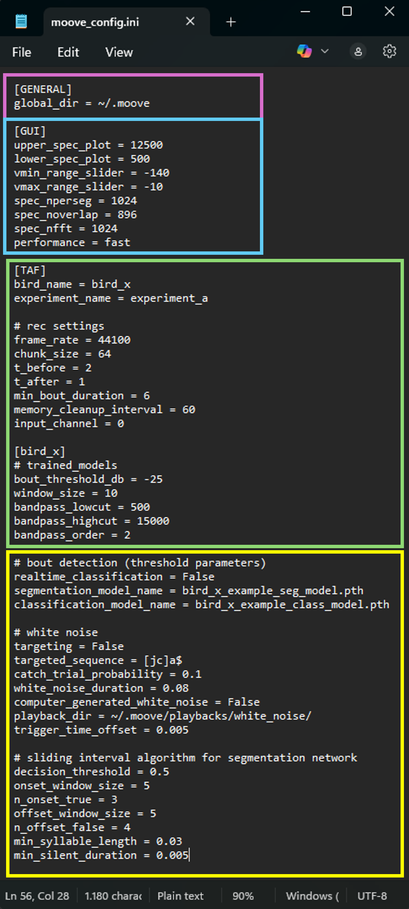
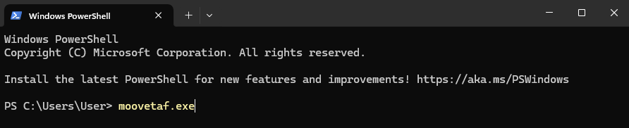

.. _moovetaf:

MooveTaf
========

You can start MooveTaf directly from the terminal/ Windows PowerShell by typing **moovetaf.exe**.

|A screen shot of a computer|

.. attention::
   While recording, we strongly recommend assigning **high priority** to the running python program executing MooveTaf, 
   as this can improve recording quality as well as classification accuracy and speed. To do so on Windows, open the Task Manager, 
   in the tab *Details* search for python, right-click on your running task and *Set Priority* to *Real-Time*.

Once started, the program will show you a list of all your connected **input and output devices** in a numerical order. 
Behind each device, it is listed how many inputs (in) and outputs (out) are available. The program will ask you to choose 
your desired input device (microphone) and output device (speaker). They can be set by typing in the respective **device number** and
pressing **Enter**. If one device offers input and output, the same number can be set for both.

If you can’t find your desired devices in the list, check out section **Installation** for a possible solution.

   Starting MooveTaf

Once you selected your input and output device, the program will start recording automatically. 
The line **"Threshold triggered"** confirms that sound input was received and a recording has started. 
The lines stating that the file has been saved **("Saving Bout", ...)** confirm that your recording has ended 
and that the respective files are saved. If you don't see these lines, take a look in the **FAQ's** below.

Baseline Recordings
-------------------

When recording a bird for the first time, you need to perform some baseline recordings before training a classification network. 
With the first start of MooveTaf, the folder ``.moove`` is created. It contains all your recorded data, trained models and config settings. 
Note that, on Linux and MacOS (and sometimes Windows) the ``.moove`` folder is hidden. On MacOS, it can be made visible pressing < CMD + shift + . > 
while in your user folder, on Linux it can be done using < Ctrl + H >. If you still can’t find it, search for “how to unhide folders”.

   Location of your .moove folder

By default, it is saved within your **username** folder under **C:/Users/<YourUsername>/**. Once created, you can **copy** the folder to your 
desired location and set this location in the terminal before starting the Moove applications. For that, use the following commands 
depending on your system, replacing the directory with your actual path. Furthermore, you have to change the *global_dir* variable 
in the ``config.ini`` file (pink box) to your actual path, e.g. C://<PathToFolder>/ or D://<PathToFolder>/. Even after changing the 
directory, all config settings have to be made in the original ``config`` file in your home directory.

.. note::
   If you don't copy the .moove folder to the new destination, it will only create the folders ``rec_data`` and 
   ``playbacks`` when starting to record. Other folders have to be copied/ created manually (pay attention to spelling).

   Setting the .moove folder location

The folder structure for recorded data in *rec_data* is as follows and is parsed into the GUI in this way. 
In case one folder doesn’t exist and the structure changes, your data cannot be found correctly. The names of your parent bird folder 
and experiment folder are set in the config (see section *Setting the config*).

   Folder structure in rec_data

A **batch.txt** file will be automatically created once the recording starts. It contains a list of all file names included in this day folder. 
You can also create and modify these files using any text editor.

   Structure of a batch file

.. note::
   While recording with MooveTaf, we don’t recommend opening the MooveGUI. Due to parallelly accessing the batch.txt file, 
   errors while writing the batch.txt file in MooveTaf can occur. If errors happen, you can update and rewrite the batch.txt 
   file in the GUI (see section *MooveGUI - Main window*) or manually correct the batch.txt file.

Setting the config
~~~~~~~~~~~~~~~~~~

The default version of the config file can be found in the moove folder in your AppData (see section *Installation*). 
However, changes in the config should always be made in the ``config.ini`` file in the ``.moove`` folder. 
It is an *.ini* file that can be opened and edited with any text editor program. Remember to save your changes once you’re done and before starting Moove.

The line **global_dir** lets you set your folder saving destination (pink box).

   Config settings for baseline recordings

In the section below [GUI], settings for opening the MooveGUI can be edited (blue box, see section *MooveGUI - Setting the config*). 
In the green highlighted box below [TAF], settings for using MooveTaf can be found. The parameters relevant for a **first-time setup** 
and **baseline recordings** are described in the table below (Table 1). For the recording, the **bird_name** and **experiment_name**
have to be individually changed. 
The section title bird_x has to be renamed to be the same as the bird_name. For different birds, the whole section [bird_x] can be copied 
and added with the different bird names as titles. All the following parameters will be described in a later chapter (see below *Targeting*).

.. attention::
      Don’t use spaces in the bird_name and experiment_name parameter.

.. table:: Parameters in the config for MooveTaf

   +-------------------------+---------------------+---------------------------------------------------------------------------------------------------------------------------+
   | **Parameter**           | **Default Value**   | **Description**                                                                                                           |
   +=========================+=====================+===========================================================================================================================+
   | bird_name               | bird_x              | Specifies the name of the bird                                                                                            |
   +-------------------------+---------------------+---------------------------------------------------------------------------------------------------------------------------+
   | experiment_name         | baseline            | Name of the experiment                                                                                                    |
   +-------------------------+---------------------+---------------------------------------------------------------------------------------------------------------------------+
   | frame_rate              | 44100 [Hz]          | Sampling rate for audio recording                                                                                         |
   +-------------------------+---------------------+---------------------------------------------------------------------------------------------------------------------------+
   | chunk_size              | 64                  | Processed samples per audio chunk during digitization; smaller values for lower latency                                   |
   +-------------------------+---------------------+---------------------------------------------------------------------------------------------------------------------------+
   | t_before                | 2 [seconds]         | Time before the bout trigger to include in recording                                                                      |
   +-------------------------+---------------------+---------------------------------------------------------------------------------------------------------------------------+
   | t_after                 | 1 [seconds]         | Time after the bout trigger to include in recording                                                                       |
   +-------------------------+---------------------+---------------------------------------------------------------------------------------------------------------------------+
   | min_bout_duration       | 4 [seconds]         | Minimum duration of a bout to be saved                                                                                    |
   +-------------------------+---------------------+---------------------------------------------------------------------------------------------------------------------------+
   | memory_cleanup_interval | 60 [seconds]        | Interval for memory cleanup to save resources                                                                             |
   +-------------------------+---------------------+---------------------------------------------------------------------------------------------------------------------------+
   | input_channel           | 0                   | Channel where the input comes in, can be one channel or two channel (0,1)                                                 |
   +-------------------------+---------------------+---------------------------------------------------------------------------------------------------------------------------+
   | bout_threshold_dB       | -30                 | Threshold in dB for detecting a bout; try around during the first time setup, **very setup- and bird-specific parameter** |
   +-------------------------+---------------------+---------------------------------------------------------------------------------------------------------------------------+
   | window_size             | 10                  | Smoothing window size for the smoothing filter for the amplitude signal                                                   |
   +-------------------------+---------------------+---------------------------------------------------------------------------------------------------------------------------+
   | bandpass_lowcut         | 500                 | Defines the lower cutoff frequency for filtering the spectrogram.                                                         |
   +-------------------------+---------------------+---------------------------------------------------------------------------------------------------------------------------+
   | bandpass_highcut        | 15000               | Defines the upper cutoff frequency for filtering the spectrogram.                                                         |
   +-------------------------+---------------------+---------------------------------------------------------------------------------------------------------------------------+
   | bandpass_order          | 2                   | Defines steepness of the filter’s cutoff; the higher the sharper the transition                                           |
   +-------------------------+---------------------+---------------------------------------------------------------------------------------------------------------------------+

In the yellow highlighted part, the realtime classification can be enabled and set up. 
However, for baseline recordings no model will be trained yet. Therefore, **realtime_classification** is by default set to **False**. 
Trained segmentation and classification models can later be added in the lines below, by default example networks are given. 
For setting up these parameters check out *Targeting* below. You can **quit** MooveTaf by pressing Ctrl + C in the terminal window. 
If you trained your models on a different chunk_size then the default 64 (see section *MooveGUI - Syllable segmentation*) 
you have to change the chunk_size in the config file before recording with online classification. 
This is not recommended since chunk_size influences classification performance and online recording performance.

Targeting
---------

Once you trained a model on your song data for following recording sessions (as explained in *MooveGUI*), 
you can use the trained networks to segment and classify online while recording.   
To use your network, transfer the trained model ``.pth`` files from the trained_models folder in your .moove folder 
to the trained_models folder in your recording computer.

.. attention::
   Make sure to use the ``.pth`` files, not any ``.bak`` files.

Additionally, you can target specific syllable sequences to get playback. 
Targeting while online classification has to be turned on separately: **targeting = True**.

The time for processing and classifying a syllable can be adjusted by changing the chunk_size. 
With the default chunk_size of 64, online syllable classification will take approximately **30ms**.

.. hint::
   Changing the chunk_size can lower classification time but also make it more prone to errors. 
   If your syllables are very similar, increasing chunk_size might increase the classification accuracy, 
   but will decrease targeting latency.

You can target different sequences and playback either computer generated white noise or different sound files (``.wav``), 
that are stored in the folder given in the section: **playback_dir**.

The path in the playback_dir points to the folder where the sound files are. They have to be ``.wav`` files. 
Since it will take all ``.wav`` files into consideration as a playback option, make sure that only files you want 
to playback are in the folder you have given. 
If multiple ``.wav`` files are in the same folder, the sounds will be chosen randomly for each target found.

While targeting with different sequences (**targeted_sequence** = hfd$, stl$), the script chooses one of the 
given sequences before each bout 
and plays the given sounds at random on the last syllable of the sequence (this is defined by the $ at the end of each sequence, 
since it follows the rules of regular expressions). You can choose any regular expression that narrows down your targeting 
to the exact sequence you want to target. 
If you are not familiar with regular expressions in python, try asking any AI or Google.

.. table:: Parameters in the config for targeting with MooveTaf

    +--------------------------------+---------------------------------+-----------------------------------------------------------------------------------------------------------------------------------------------------------------------------------------------+
    | **Parameter**                  | **Default Value**               | **Description**                                                                                                                                                                               |
    +================================+=================================+===============================================================================================================================================================================================+
    | realtime_classification        | False                           |                                                                                                                                                                                               |
    +--------------------------------+---------------------------------+-----------------------------------------------------------------------------------------------------------------------------------------------------------------------------------------------+
    | segmentation_model_name        | bird_x_example_seg_model.pth    | Name of the segmentation model                                                                                                                                                                |
    +--------------------------------+---------------------------------+-----------------------------------------------------------------------------------------------------------------------------------------------------------------------------------------------+
    | classification_model_name      | bird_x_example_class_model.pth  | Name of the classification model                                                                                                                                                              |
    +--------------------------------+---------------------------------+-----------------------------------------------------------------------------------------------------------------------------------------------------------------------------------------------+
    | targeting                      | False                           | Only when targeting is wanted, for realtime online targeting of the following targeted_sequence                                                                                               |
    +--------------------------------+---------------------------------+-----------------------------------------------------------------------------------------------------------------------------------------------------------------------------------------------+
    | targeted_sequence              | [jc]a$                          | Target sequence(s) are targeted as regular expressions of the already labeled sequence. When multiple sequences are given, a target sequence is chosen randomly at the beginning of the bout. |
    +--------------------------------+---------------------------------+-----------------------------------------------------------------------------------------------------------------------------------------------------------------------------------------------+
    | catch_trial_probability        | 0.1                             | How many bouts are not targeted,                                                                                                                                                              |
    |                                |                                 |                                                                                                                                                                                               |
    |                                |                                 | Value between 0 and 1                                                                                                                                                                         |
    +--------------------------------+---------------------------------+-----------------------------------------------------------------------------------------------------------------------------------------------------------------------------------------------+
    | white_noise_duration           | 0.08 [seconds]                  | Duration of the computer-generated white noise.                                                                                                                                               |
    +--------------------------------+---------------------------------+-----------------------------------------------------------------------------------------------------------------------------------------------------------------------------------------------+
    | computer_generated_white_noise | False                           | Playback of computer-generated white noise                                                                                                                                                    |
    +--------------------------------+---------------------------------+-----------------------------------------------------------------------------------------------------------------------------------------------------------------------------------------------+
    | playback_dir                   | ~/.moove/playbacks/white_noise/ | Folder where playback files are. Playback files are taken when computer_generated_white_noise is false. Folder can contain several files, which are chosen randomly in the moment of playback |
    +--------------------------------+---------------------------------+-----------------------------------------------------------------------------------------------------------------------------------------------------------------------------------------------+
    | trigger_time_offset            | 0.005 [seconds]                 | Time after playback when a new trigger cannot be triggered                                                                                                                                    |
    +--------------------------------+---------------------------------+-----------------------------------------------------------------------------------------------------------------------------------------------------------------------------------------------+
    | decision_threshold             | 0.5 [%]                         | Defines a probability threshold for detecting a syllable segment.                                                                                                                             |
    +--------------------------------+---------------------------------+-----------------------------------------------------------------------------------------------------------------------------------------------------------------------------------------------+
    | onset_window_size              | 5[chunks]                       | Specifies the size of the sliding window used to detect onsets.                                                                                                                               |
    +--------------------------------+---------------------------------+-----------------------------------------------------------------------------------------------------------------------------------------------------------------------------------------------+
    | n_onset_true                   | 3 [chunks]                      | Sets the number of *True* detections within the sliding window.                                                                                                                               |
    +--------------------------------+---------------------------------+-----------------------------------------------------------------------------------------------------------------------------------------------------------------------------------------------+
    | offset_window_size             | 5 [chunks]                      | Specifies the size of the sliding window used to detect offsets.                                                                                                                              |
    +--------------------------------+---------------------------------+-----------------------------------------------------------------------------------------------------------------------------------------------------------------------------------------------+
    | n_offset_false                 | 4 [chunks]                      | Sets the number of *False* detections within the sliding window.                                                                                                                              |
    +--------------------------------+---------------------------------+-----------------------------------------------------------------------------------------------------------------------------------------------------------------------------------------------+
    | min_syllable_length            | 0.03 [seconds]                  | Specifies the minimum duration of a syllable that a syllable segment must have.                                                                                                               |
    +--------------------------------+---------------------------------+-----------------------------------------------------------------------------------------------------------------------------------------------------------------------------------------------+
    | min_silent_duration            | 0.005 [seconds]                 | Specifies the minimum silence between two syllables to be counted as separate units.                                                                                                          |
    +--------------------------------+---------------------------------+-----------------------------------------------------------------------------------------------------------------------------------------------------------------------------------------------+

