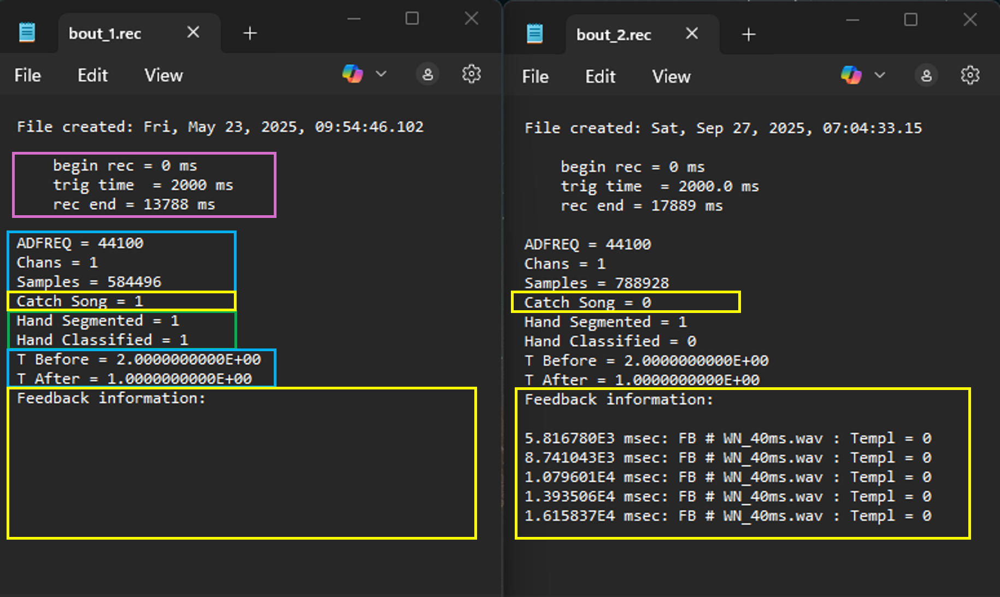
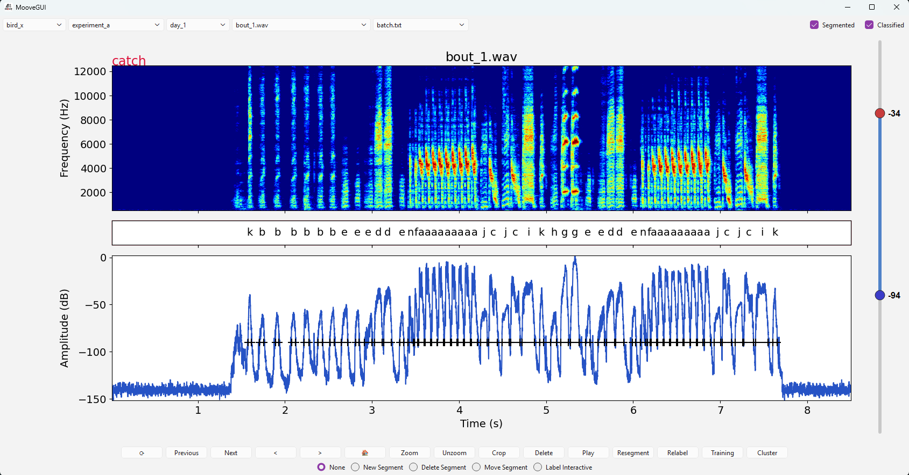
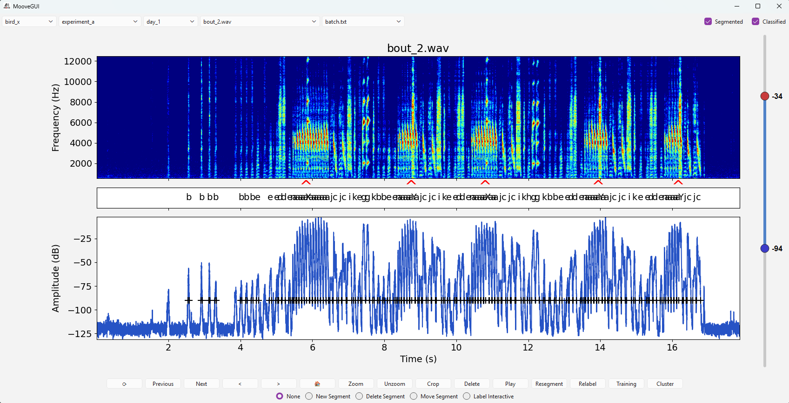

.. _rec-file:

REC file and Feedback Information
===============================================

While recording with MooveTaf, information about each recorded file will be saved in a ``.rec`` file within the specific *rec_data* folder, along with the ``.wav`` file and the ``.not.mat`` file. 
This ``.rec`` file contains specific information set in the config (see section *MooveTaf*) as well as information about the song file generated during the recording.

The first line shows the exact date and time point at which the file was created, thus when the bout was saved. This information can change when you **crop** a file 
(as described in *MooveGUI*), the new date will depict the time of cropping.

The pink highlighted part describes the time at which the recording started, **begin rec** (usually 0 ms). 
**trig time** describes the time at which the recording was triggered, which can be set in the config (see section *MooveTaf*). 
It describes how much time is included before the recording was triggered. The end of the recording is shown as **rec end**. 

The blue boxes describe general parameters such as the recording frequency **ADFREQ** (here: 44100Hz), the number of channels **Chans** (here: 1), 
the number of recorded **Samples** (here: 312320) and the time included before (**T before**, here: 2ms) and after (**T after**, here: 1ms) recording was triggered, 
which can be set in the config (see section *MooveTaf*). 

Below in the green box, the lines **Hand Segmented** and **Hand Classified** (here: 1) depict whether you 
ticked the checkboxes for manual segmentation and classification in the MooveGUI for this file (see *MooveGUI*). 
Once the checkbox is set, the line will be set to 1 else it is 0. 

The yellow boxes depict feedback that was directly 
generated during the recording and training session. You can check whether the current file was labeled as a catch file during training, 
and therefore no feedback was given (**Catch Song**, here: 0 and 1). This will be set to 1 in case of a catch file and 0 in case of non-catch 
files with information about the feedback if feedback was triggered. The amount of catch trials during recording can be set in the config (see section *MooveTaf*). 
In case feedback was given during this song bout, the **time points** of the feedback will be written below. Furthermore, following the **FB #** 
the name of your **used feedback file** (as given in the config) will be shown, and the number of the template (by default 0).

   Rec files

The feedback given during the training will also be directly shown when opening the file in the GUI. **Catch files** will have a red box drawn around the syllable labels, 
and additionally the word **catch** will be shown in the upper left above the spectrogram.

   Marking of catch files

In the case of **feedback**, for example white noise playback, the exact time points of the feedback will be shown as small red triangles below the spectrogram, depicting the exact moment
of when the target syllable was detected.

   Display of feedback information

